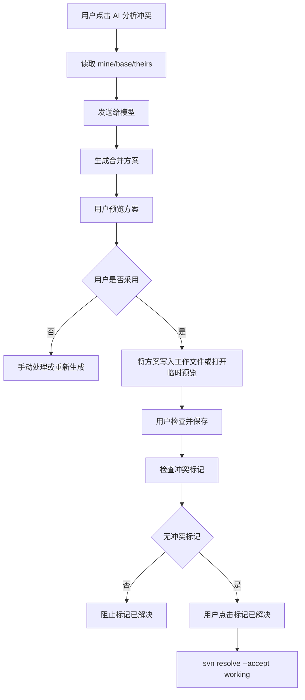
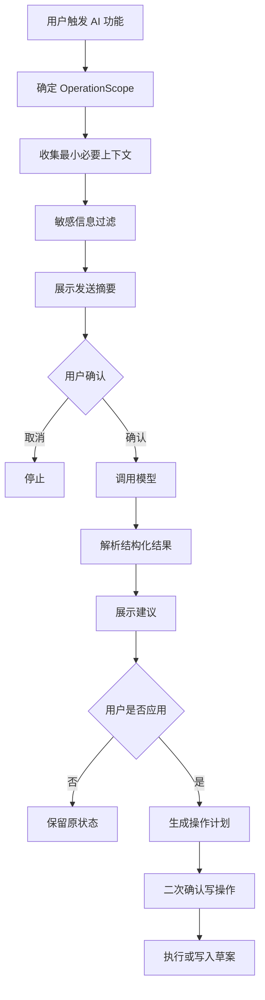

# SVN Workbench AI-First 规划文档

> 产品暂名：SVN Workbench for VS Code / SVN 工作台  
> 文档类型：AI-first 产品规划  
> 编写日期：2026-07-04  
> 所属阶段：规划阶段  
> 文档策略：新增文件，不覆盖旧文档

## 1. 当前阶段判断

当前项目处于：

```text
调研 -> 规划 -> 设计 -> 技术验证 -> 开发 -> 测试 -> 验收 -> 交付 -> 运营迭代
          ↑
        当前阶段
```

更准确地说：

- 已完成初步调研：参考了 VS Code SVN 插件、VisualSVN、TortoiseSVN、TortoiseMerge、SVN CLI、VS Code API。
- 正在进行产品规划：明确产品定位、MVP 边界、页面流程、技术可行性、AI-first 方向。
- 尚未进入正式设计：还没有 UI 线框、交互稿、接口契约、组件规格。
- 尚未进入技术验证：还没有跑通 VS Code Extension + SVN CLI 的最小原型。

后续研发周期统一按以下阶段推进：

```text
调研 -> 规划 -> 设计 -> 技术验证 -> 开发 -> 测试 -> 验收 -> 交付 -> 运营迭代
```

## 2. AI-first 核心判断

SVN Workbench 不应该只做“SVN 命令图形化”，而应该做：

```text
一个懂 SVN、懂代码变更、懂团队提交习惯的 AI SVN 助手。
```

AI 做得好，产品差异化会非常明显：

- 不只是展示哪些文件改了，而是告诉用户哪些应该提交。
- 不只是显示远端更新，而是解释哪些更新和当前任务有关。
- 不只是打开冲突文件，而是给出合并方案，让用户决策。
- 不只是生成提交说明，而是检查提交风险。
- 不只是写 ignore 规则，而是发现团队长期误提交的生成物。

所以 AI 不应是后期装饰功能，而应从规划阶段进入核心架构。

## 3. AI 产品定位

建议将 AI 能力命名为：

```text
SVN AI Copilot
```

中文可叫：

```text
SVN 智能助手
```

定位：

- 负责分析。
- 负责推荐。
- 负责解释。
- 负责生成方案。
- 不直接做不可逆操作。

一句话：

```text
AI 帮你看清楚 SVN 变更和风险，你来做最终决策。
```

## 4. AI 设计原则

### 4.1 AI 建议，用户决策

AI 可以：

- 推荐提交文件。
- 推荐排除文件。
- 生成提交说明。
- 生成忽略规则草案。
- 分析冲突。
- 生成合并方案。
- 总结远端更新。
- 检查风险。

AI 不可以直接：

- 自动提交。
- 自动更新。
- 自动还原。
- 自动删除。
- 自动强制解锁。
- 自动标记冲突已解决。
- 自动把敏感文件发给模型。

### 4.2 规则优先，AI 增强

确定性规则先做：

- 生成物排除。
- 敏感文件识别。
- 冲突阻止提交。
- 他人锁定阻止提交。
- 空提交信息阻止提交。

AI 后做：

- 解释为什么排除。
- 判断边界文件是否应该提交。
- 根据上下文生成建议。
- 发现规则之外的异常。

### 4.3 默认保守

默认设置：

- AI 默认关闭。
- 模型需要用户配置。
- 每次发送文件内容前展示范围。
- 敏感文件默认不发送内容。
- 冲突合并方案默认只预览，不自动应用。

### 4.4 企业友好

企业场景需要：

- 可完全禁用 AI。
- 可只允许内网模型。
- 可禁止发送 diff。
- 可只发送文件名和 SVN 状态。
- 可配置模型白名单。
- 可配置审计日志。

## 5. AI 能力总览

| 场景 | AI 能力 | 优先级 | 是否进入 MVP |
| --- | --- | --- | --- |
| 提交 | 生成提交说明 | P0 | 可以 |
| 提交 | 推荐提交/排除文件 | P0 | 可以 |
| 提交 | 检查敏感文件和生成物 | P0 | 可以 |
| 提交 | 提交风险总结 | P1 | 可以 |
| 更新 | 总结远端更新 | P1 | 可选 |
| 更新 | 推荐更新范围 | P1 | 可选 |
| 更新 | 冲突风险预测 | P1 | 后置 |
| 冲突 | 解释冲突原因 | P0 | 可以 |
| 冲突 | 生成合并方案 | P1 | 可以做原型 |
| 冲突 | 自动应用合并方案 | P2 | 不默认 |
| 历史 | 总结日志 | P1 | 可选 |
| 忽略 | 生成 svn:ignore 草案 | P0 | 可以 |
| 设置 | 推荐项目规则 | P1 | 后置 |
| 代码审查 | 提交前风险审查 | P1 | 后置 |

## 6. 模型接入方向

### 6.1 接入原则

模型接入应以 OpenAI-compatible 协议为主。

原因：

- 多数国产模型和本地模型平台都支持或部分支持 OpenAI-compatible 接口。
- 扩展端可以复用同一套 Client。
- 用户只需要配置 `baseUrl`、`apiKey`、`model`。
- 企业内网模型网关也通常会做成 OpenAI-compatible。

同时保留原生适配器：

- 对某些模型的特殊参数、长上下文、文件能力、思考模式、工具调用做增强。

### 6.2 推荐 Provider 抽象

```ts
interface AiProvider {
  id: string;
  name: string;
  protocol: 'openai-compatible' | 'vscode-lm' | 'ollama' | 'custom';
  listModels(): Promise<AiModel[]>;
  complete(request: AiCompletionRequest): Promise<AiCompletionResult>;
  stream?(request: AiCompletionRequest): AsyncIterable<AiCompletionChunk>;
  validateConfig(config: AiProviderConfig): Promise<AiProviderHealth>;
}
```

### 6.3 推荐 Model 配置

```ts
interface AiModelProfile {
  id: string;
  displayName: string;
  providerId: string;
  modelName: string;
  baseUrl: string;
  capability: {
    chat: boolean;
    reasoning: boolean;
    longContext: boolean;
    jsonMode: boolean;
    toolCalling: boolean;
    streaming: boolean;
    localOnly: boolean;
  };
  defaultUseCases: AiUseCase[];
}
```

## 7. 国产与本地模型支持规划

> 下表按 2026-07-04 调研结果规划，实际模型名、价格、上下文长度和接口细节以后续官方文档为准。

| Provider | 推荐接入方式 | 适合场景 | 备注 |
| --- | --- | --- | --- |
| DeepSeek | OpenAI-compatible | 提交说明、代码分析、冲突推理 | 官方 API 文档说明兼容 OpenAI/Anthropic 格式 |
| 阿里云百炼 / 通义千问 | OpenAI-compatible + DashScope 可选 | 企业接入、中文、长上下文 | 官方文档说明千问支持 OpenAI 兼容接口 |
| 智谱 GLM / Z.ai | OpenAI-compatible / Anthropic-compatible | 编码、Agent、企业模型 | 官方文档提供 OpenAI 兼容调用地址 |
| Moonshot / Kimi | OpenAI-compatible | 长上下文、日志总结、变更分析 | 官方文档说明可直接用 OpenAI SDK |
| 腾讯混元 | OpenAI-compatible | 企业腾讯云生态 | 官方文档说明兼容 OpenAI 接口规范 |
| 百度千帆 / 文心 | OpenAI-compatible | 百度云企业生态 | 官方文档说明通过 base_url/model 调用 |
| Ollama | OpenAI-compatible / Ollama API | 本地离线、隐私敏感场景 | 官方文档提供 OpenAI 兼容接口 |
| 企业内网模型网关 | OpenAI-compatible | 政企、内网研发 | 由企业提供 baseUrl/apiKey/model |

## 8. 模型选择交互

### 8.1 首次启用 AI

入口：

- 提交页 `AI 生成提交说明`。
- 提交页 `AI 筛选`。
- 冲突中心 `AI 分析冲突`。
- 设置页 `启用 SVN 智能助手`。

首次点击时弹出：

```text
启用 SVN 智能助手

AI 可以帮助生成提交说明、筛选提交文件、分析冲突和总结更新。
发送给模型的内容可能包含代码片段，请选择模型来源并确认隐私设置。
```

按钮：

- `配置模型`
- `只使用本地规则`
- `暂不启用`

### 8.2 模型选择页

页面结构：

```text
模型来源
  DeepSeek
  阿里云百炼/通义千问
  智谱 GLM/Z.ai
  Moonshot/Kimi
  腾讯混元
  百度千帆/文心
  Ollama 本地模型
  OpenAI-compatible 自定义
  VS Code Language Model

连接配置
  Base URL
  API Key
  Model
  测试连接

默认用途
  提交说明
  文件筛选
  冲突分析
  更新总结
  日志总结
```

### 8.3 模型能力标签

每个模型显示标签：

- `中文强`
- `代码强`
- `推理强`
- `长上下文`
- `本地离线`
- `企业内网`
- `支持流式`
- `支持 JSON`

### 8.4 推荐默认模型策略

不为用户强行选择具体模型。

推荐策略：

- 企业内网用户：优先 `OpenAI-compatible 自定义`。
- 隐私敏感用户：优先 `Ollama 本地模型`。
- 中文和代码分析：推荐用户选择国产代码/推理模型。
- 长日志和大 diff：推荐长上下文模型。

## 9. AI 隐私设置

### 9.1 发送内容级别

用户可选：

| 级别 | 发送内容 | 适合场景 |
| --- | --- | --- |
| 最小 | 文件名、路径、状态、大小 | 隐私敏感 |
| 摘要 | diff 统计、变更摘要、本地规则结果 | 普通企业 |
| 片段 | 用户选中文件的 diff 片段 | 提交说明、冲突分析 |
| 完整 | 当前任务范围内完整 diff | 个人项目或内网模型 |

默认：

```text
摘要
```

### 9.2 敏感文件策略

以下文件默认不发送内容：

- `.env`
- `.env.*`
- `*.key`
- `*.pem`
- `*.pfx`
- `*.crt`
- `*.cer`
- `id_rsa`
- `id_ed25519`
- 包含 `password`、`secret`、`token` 的文件。

### 9.3 发送前确认

发送前展示：

```text
即将发送给 AI：

文件数：8
Diff 字符数：10,240
敏感文件：0
二进制文件：1 个，仅发送文件名和大小
模型：DeepSeek / deepseek-xxx
```

按钮：

- `发送`
- `查看详情`
- `改为只发送摘要`
- `取消`

## 10. AI 功能一：提交说明生成

### 10.1 入口

- 提交页底部。
- 快捷按钮 `AI 生成`。
- 命令面板 `SVN: AI 生成提交说明`。

### 10.2 输入

- 已勾选文件列表。
- SVN 状态。
- 文件类型。
- diff 摘要。
- 用户选择的模板。
- 工单号。
- 分支/路径。
- 最近提交习惯。

### 10.3 输出

```text
需求: 完成订单列表筛选逻辑

关联: TASK-123
范围: 订单模块
说明:
- 新增订单状态筛选条件
- 调整接口参数映射
- 更新页面样式
```

### 10.4 交互

AI 生成后提供：

- `使用此说明`
- `重新生成`
- `更简洁`
- `更详细`
- `改成缺陷修复`
- `只保留第一行`

## 11. AI 功能二：提交内容筛选

### 11.1 入口

提交页顶部：

```text
AI 筛选
```

### 11.2 输出分类

AI 将文件分为：

- 推荐提交。
- 建议排除。
- 需要确认。
- 阻止提交。

### 11.3 典型规则

推荐排除：

- `dist/**`
- `build/**`
- `target/**`
- `obj/**`
- `bin/Debug/**`
- `bin/Release/**`
- `node_modules/**`
- `*.log`
- `*.tmp`

需要确认：

- 普通 `bin/**`。
- 图片。
- Office。
- 大文件。
- `.json` 配置。
- SQL。
- 证书或密钥类文件。

阻止：

- 冲突文件。
- 他人锁定文件。
- 超出 OperationScope 的文件。

### 11.4 交互

```text
AI 已分析当前范围 38 个文件

推荐提交：12 个
建议排除：19 个
需要确认：6 个
阻止提交：1 个
```

按钮：

- `应用推荐选择`
- `仅显示推荐提交`
- `查看建议排除`
- `逐个确认风险文件`
- `生成忽略规则草案`

### 11.5 用户控制

- AI 不直接改勾选。
- 用户点击 `应用推荐选择` 后才修改选择。
- 已固定选择的文件不受 AI 批量取消影响。

## 12. AI 功能三：提交风险审查

### 12.1 入口

提交页 `提交前 AI 检查`。

### 12.2 检查内容

- 是否误提交生成物。
- 是否误删大量文件。
- 是否修改敏感配置。
- 是否包含密钥。
- 是否提交大文件。
- 是否改了数据库脚本。
- 是否和提交说明不匹配。
- 是否当前范围过大。
- 是否缺少必要配套文件。

### 12.3 输出示例

```text
AI 风险检查

高风险：
- config/prod.yaml 修改了生产接口地址，请确认是否应提交。

中风险：
- 新增 1 个 SQL 文件，建议确认是否需要数据库变更说明。
- package-lock.json 有变化，但 package.json 未变化，请确认是否正常。

低风险：
- 包含 2 个图片资源，无法进行文本 diff。
```

## 13. AI 功能四：智能更新建议

### 13.1 入口

- 工作台 `智能更新建议`。
- 提交页 `检查远端更新`。
- 状态栏 `远端 +N`。

### 13.2 输入

- 当前本地修改文件。
- 当前提交范围。
- `svn status -u` 结果。
- 远端日志 changed paths。
- 用户当前模板/工单。

### 13.3 输出分类

- 建议立即更新。
- 可稍后更新。
- 风险更新。
- 阻止更新。

### 13.4 交互

```text
远端有 16 个变更

建议立即更新：6 个
可稍后更新：7 个
风险更新：3 个
```

按钮：

- `更新推荐项`
- `更新当前目录`
- `更新全部`
- `查看风险`
- `取消`

### 13.5 重要提示

选择性更新会导致 mixed revision。

文案：

```text
智能更新只会更新你勾选的路径。SVN 允许这样做，但工作副本可能进入 mixed revision 状态。
```

## 14. AI 功能五：冲突分析与合并方案

这是 AI-first 最有价值的功能之一。

### 14.1 产品定位

不叫：

```text
AI 自动解决冲突
```

建议叫：

```text
AI 生成合并方案
```

或：

```text
AI 辅助解决冲突
```

核心原则：

```text
AI 出方案，用户做决策。
```

### 14.2 输入

每个冲突文件包含：

- Mine：我的版本。
- Theirs：远端版本。
- Base：共同基准版本。
- Working：当前工作文件。
- 冲突标记位置。
- 文件语言类型。
- 最近提交信息。
- 当前任务描述。

### 14.3 输出

AI 输出结构：

```json
{
  "summary": "本次冲突集中在订单状态字段命名和筛选参数结构。",
  "mineIntent": "本地修改新增了 orderStatus 多选筛选。",
  "theirsIntent": "远端修改将 status 字段重命名为 state。",
  "conflictPoints": [
    "同一行修改了筛选参数字段名",
    "接口参数结构从字符串变为数组"
  ],
  "suggestedResolution": "保留本地多选逻辑，但使用远端新的 state 字段名。",
  "risk": "需要确认后端接口是否已经支持 stateList 参数。",
  "mergedPatch": "..."
}
```

### 14.4 冲突页交互方案 A：决策卡片

适合 MVP。

布局：

```text
左侧：冲突文件列表
中间：VS Code diff / 文件内容
右侧：AI 决策卡片
```

AI 决策卡片包含：

- 冲突摘要。
- 我的修改意图。
- 远端修改意图。
- AI 推荐方案。
- 风险提示。
- 可应用的候选补丁。

按钮：

- `采用我的`
- `采用远端`
- `采用 AI 方案`
- `复制 AI 方案`
- `手动编辑`
- `重新分析`

### 14.5 冲突页交互方案 B：逐块决策

适合后续增强。

每个冲突块显示：

```text
冲突块 1/5

我的修改：
...

远端修改：
...

AI 建议：
...

按钮：
使用我的 / 使用远端 / 使用 AI 方案 / 手动编辑
```

优势：

- 用户决策粒度更细。
- 不需要一次相信 AI 处理整个文件。
- 安全感更强。

### 14.6 冲突页交互方案 C：对话式处理

适合高级版。

用户可以问：

```text
为什么这里建议保留远端？
这个接口参数应该用哪个？
帮我只合并第 2 个冲突块。
生成一个更保守的方案。
```

AI 回答后生成新方案。

### 14.7 MVP 推荐方案

MVP 建议采用：

```text
方案 A：决策卡片 + VS Code 原生 diff + 可选 TortoiseMerge
```

理由：

- 不必自研复杂三方 diff 面板。
- 借助 VS Code diff 和外部 TortoiseMerge 保持可靠。
- AI 重点放在“理解冲突”和“给决策建议”。

### 14.8 应用 AI 方案流程



### 14.9 安全红线

AI 不允许：

- 在用户未预览时覆盖工作文件。
- 自动执行 `svn resolve`。
- 自动丢弃 mine 或 theirs。
- 自动处理二进制冲突。

## 15. AI 功能六：日志理解

### 15.1 场景

用户想知道：

- 某个修订改了什么。
- 某个人今天提交了什么。
- 某个目录最近为什么变多。
- 更新前这些远端提交是否和自己有关。

### 15.2 功能

- 总结最近 N 条日志。
- 总结某个修订。
- 按模块归类远端提交。
- 从日志中提取工单号。
- 识别高风险提交，如数据库、配置、接口变更。

### 15.3 输出示例

```text
最近 12 个远端提交总结：

订单模块：
- r12870 增加订单导出字段
- r12872 修复订单状态筛选

配置变更：
- r12875 修改生产接口超时时间，请更新前注意

与你当前修改可能相关：
- r12872 修改了 src/pages/order，建议先查看差异
```

## 16. AI 功能七：忽略规则与项目策略生成

### 16.1 场景

用户长期看到生成物：

- `dist`
- `build`
- `obj`
- `bin/Debug`
- `*.log`

### 16.2 AI 功能

- 分析未版本控制文件。
- 判断哪些是生成物。
- 生成 `svn:ignore` 草案。
- 生成团队项目策略文件草案。

### 16.3 输出

```text
建议加入 svn:ignore：

dist
build
*.log
*.tmp
```

如果文件已被版本控制：

```text
这些文件已经被 SVN 跟踪，加入 ignore 不会让它们消失。
如团队决定不再版本控制，需要执行 svn remove --keep-local 并提交。
```

## 17. AI 功能八：团队规则学习

### 17.1 目标

让工具逐渐懂团队习惯。

### 17.2 可学习内容

- 常用提交模板。
- 工单号格式。
- 常提交目录组合。
- 常误提交文件。
- 生成物路径。
- 高风险文件。
- 团队提交信息风格。

### 17.3 存储方式

第一版不做复杂模型训练。

只做本地规则记忆：

```text
.vscode/svn-workbench.rules.json
```

或工作区状态：

```text
workspaceState
```

用户确认后再保存。

## 18. AI 功能九：对话式 SVN 助手

### 18.1 后续高级功能

在 SVN 工作台中提供一个对话入口：

```text
问 SVN 助手
```

用户可以问：

```text
我现在适合提交哪些文件？
帮我看看这次提交有没有风险。
这个冲突应该怎么合？
远端最近改了什么？
为什么这些文件不能提交？
帮我生成忽略规则。
```

### 18.2 工具调用边界

AI 可以调用只读工具：

- 获取 status。
- 获取 log。
- 获取 diff 摘要。
- 获取文件类型。

AI 不能直接调用写工具。

写工具需要用户确认：

- update。
- commit。
- revert。
- resolve。
- propset。
- lock/unlock。

## 19. AI 交互总流程



## 20. AI 数据流

```text
SVN status/log/diff
  -> Context Collector
  -> Privacy Filter
  -> Prompt Builder
  -> AiProvider
  -> Response Parser
  -> Recommendation Model
  -> UI Review
  -> User Decision
  -> Operation Plan
```

## 21. AI Prompt 设计方向

### 21.1 提交筛选 Prompt 输出要求

要求模型输出 JSON：

```json
{
  "recommended": [],
  "excluded": [],
  "needsReview": [],
  "blocked": [],
  "summary": ""
}
```

每个文件必须包含：

- path。
- decision。
- confidence。
- reason。
- risk。

### 21.2 冲突分析 Prompt 输出要求

要求模型输出：

- 冲突摘要。
- mine 意图。
- theirs 意图。
- base 变化点。
- 推荐合并策略。
- 风险提示。
- merged candidate。

### 21.3 输出校验

所有 AI 输出都必须做校验：

- JSON 是否可解析。
- 文件路径是否在 OperationScope 内。
- 是否引用了不存在文件。
- 是否要求执行危险操作。
- 是否出现敏感信息回显。

## 22. AI 结果可信度设计

### 22.1 可信度分级

| 级别 | 含义 | UI |
| --- | --- | --- |
| 高 | 规则和 AI 都一致 | 绿色推荐 |
| 中 | AI 推荐但规则无法确认 | 黄色需要确认 |
| 低 | AI 不确定 | 灰色建议 |
| 阻止 | 规则明确不允许 | 红色阻止 |

### 22.2 解释必须存在

任何 AI 推荐都必须有原因。

不允许只显示：

```text
AI 建议提交此文件
```

必须显示：

```text
AI 建议提交：该文件位于当前订单模块，diff 显示新增筛选逻辑，与提交摘要匹配。
```

## 23. 是否还需要自研差异面板

AI-first 后，差异面板策略可以调整。

### 23.1 MVP 不自研复杂差异面板

MVP 使用：

- VS Code 原生 diff。
- AI 差异摘要。
- AI 冲突分析。
- TortoiseMerge 外部打开。

这样已经能覆盖很多场景。

### 23.2 什么时候需要自研面板

以下情况再自研：

- 用户强烈需要逐块冲突按钮。
- VS Code diff 无法承载三方合并。
- AI 方案应用需要可视化预览。
- 图片差异需要更丰富交互。

### 23.3 结论

短期：

```text
不自研完整 TortoiseMerge 面板。
```

中期：

```text
做 AI 决策卡片 + VS Code diff。
```

长期：

```text
按反馈决定是否自研三方合并 Webview。
```

## 24. AI 设置项规划

```json
{
  "svnWorkbench.ai.enabled": false,
  "svnWorkbench.ai.provider": "openai-compatible",
  "svnWorkbench.ai.model": "",
  "svnWorkbench.ai.baseUrl": "",
  "svnWorkbench.ai.privacyLevel": "summary",
  "svnWorkbench.ai.sendDiff": false,
  "svnWorkbench.ai.sendSensitiveFiles": false,
  "svnWorkbench.ai.confirmBeforeSend": true,
  "svnWorkbench.ai.maxFiles": 100,
  "svnWorkbench.ai.maxDiffChars": 12000,
  "svnWorkbench.ai.commitMessage.enabled": true,
  "svnWorkbench.ai.commitSelection.enabled": true,
  "svnWorkbench.ai.updateAdvice.enabled": true,
  "svnWorkbench.ai.conflictAdvice.enabled": true,
  "svnWorkbench.ai.allowApplyConflictPatch": false,
  "svnWorkbench.ai.auditLog.enabled": false
}
```

## 25. AI 技术验证计划

### 25.1 验证目标

在正式开发前验证：

- OpenAI-compatible 接口能否统一接入多模型。
- 模型能否稳定输出结构化 JSON。
- 提交筛选准确率是否可接受。
- 冲突合并建议是否有价值。
- 本地隐私过滤是否可控。

### 25.2 验证任务

1. 建立 `AiProvider` 抽象。
2. 实现 OpenAI-compatible provider。
3. 实现 Ollama provider。
4. 实现模型连接测试。
5. 准备 20 组提交样本。
6. 准备 10 组冲突样本。
7. 测试 JSON 输出稳定性。
8. 测试中文提交说明质量。
9. 测试敏感文件过滤。
10. 输出 AI 技术验证报告。

### 25.3 验证指标

提交筛选：

- 生成物排除准确率。
- 推荐提交准确率。
- 误排除率。
- 误推荐率。

冲突建议：

- 是否能解释冲突。
- 是否能生成可读方案。
- 是否能保留双方意图。
- 是否产生错误代码。

性能：

- 首次响应时间。
- 流式响应可用性。
- 大 diff 截断后的质量。

## 26. AI 在研发周期中的位置

### 26.1 调研阶段

产物：

- 模型供应商调研。
- OpenAI-compatible 兼容性调研。
- TortoiseSVN/TortoiseMerge 工作流调研。
- 用户误提交和冲突场景调研。

### 26.2 规划阶段

当前阶段。

产物：

- AI-first 规划。
- AI 能力边界。
- AI 功能优先级。
- AI 风险红线。
- AI MVP 范围。

### 26.3 设计阶段

产物：

- AI 设置页线框。
- AI 筛选面板线框。
- AI 冲突决策卡片线框。
- AI 发送确认弹窗。
- AI 错误提示文案。

### 26.4 技术验证阶段

产物：

- AiProvider 原型。
- 多模型调用 demo。
- 提交筛选 prompt。
- 冲突分析 prompt。
- 样本评估报告。

### 26.5 开发阶段

产物：

- AI Provider 模块。
- AI Prompt Builder。
- Privacy Filter。
- AI Result Parser。
- AI UI 面板。
- 与提交页、冲突中心、更新页集成。

### 26.6 测试阶段

产物：

- 模型输出测试。
- 隐私过滤测试。
- JSON 解析容错测试。
- 提交筛选准确率测试。
- 冲突建议人工评估。

### 26.7 验收阶段

验收重点：

- AI 不会突破 OperationScope。
- AI 不会自动执行危险写操作。
- AI 推荐有解释。
- AI 敏感信息过滤生效。
- AI 失败不影响 SVN 基础功能。

### 26.8 交付阶段

交付内容：

- AI 配置说明。
- 模型接入说明。
- 隐私说明。
- 企业禁用 AI 指南。
- 常见问题。

### 26.9 运营迭代阶段

迭代方向：

- 收集误推荐案例。
- 优化规则。
- 优化 prompt。
- 增加模型适配。
- 增加团队策略文件。
- 增加 AI 评估基准。

## 27. AI MVP 建议范围

第一版 AI 不宜做太多，建议只做 4 件事：

1. AI 生成提交说明。
2. AI 推荐提交/排除文件。
3. AI 生成忽略规则草案。
4. AI 分析冲突并给合并建议。

这 4 个能力最贴近 SVN 用户痛点。

暂缓：

- 对话式 SVN 助手。
- 智能更新自动执行。
- 日志长期分析。
- 团队规则学习。
- 自研三方合并面板。

## 28. AI 风险清单

| 风险 | 等级 | 对策 |
| --- | --- | --- |
| AI 推荐误提交敏感文件 | P0 | 敏感文件规则优先，AI 不能覆盖 |
| AI 突破右键文件夹范围 | P0 | OperationScope 校验 AI 输出 |
| AI 合并冲突产生错误代码 | P0 | 只生成方案，用户确认和测试 |
| AI 自动执行危险操作 | P0 | 架构层禁止 AI 调用写操作 |
| 发送代码到外部模型 | P1 | 默认关闭，发送前确认，隐私级别 |
| 模型输出格式不稳定 | P1 | JSON schema 校验和重试 |
| 国产模型接口差异 | P1 | Provider 抽象 + 健康检查 |
| 大 diff 超上下文 | P1 | 摘要、截断、分块 |
| 响应慢 | P2 | 流式输出、取消、缓存 |

## 29. 下一份设计文档建议

AI 方向下一步应该进入设计阶段，建议新增：

```text
2026-07-04-svn-workbench-ai-interaction-design.md
```

内容：

- AI 设置页线框。
- 模型选择页线框。
- AI 提交筛选面板线框。
- AI 冲突决策卡片线框。
- 发送前确认弹窗。
- AI 输出失败状态。
- AI 权限与隐私提示文案。

## 30. 当前决策建议

建议现在做出这些规划决策：

1. 产品方向采用 AI-first，但基础 SVN 功能不能依赖 AI。
2. 模型接入优先 OpenAI-compatible。
3. 国产模型和本地模型作为一等公民。
4. AI 不直接执行写操作。
5. 冲突处理先做 AI 决策卡片，不急着自研 TortoiseMerge 级面板。
6. 第一版 AI 聚焦提交、筛选、忽略规则、冲突建议。
7. 后续按 `调研 -> 规划 -> 设计 -> 技术验证 -> 开发 -> 测试 -> 验收 -> 交付 -> 运营迭代` 推进。

## 31. 参考资料

- DeepSeek API Docs：<https://api-docs.deepseek.com/>
- 阿里云百炼 OpenAI Chat 接口兼容：<https://help.aliyun.com/zh/model-studio/compatibility-of-openai-with-dashscope>
- 阿里云百炼千问 API 参考：<https://help.aliyun.com/zh/model-studio/qwen-api-reference/>
- 智谱 GLM / Z.ai 模型切换文档：<https://docs.bigmodel.cn/cn/coding-plan/latest-model>
- Kimi API Overview：<https://platform.kimi.ai/docs/api/overview>
- Kimi OpenAI 迁移指南：<https://platform.kimi.ai/docs/guide/migrating-from-openai-to-kimi>
- 腾讯混元 OpenAI 兼容接口：<https://cloud.tencent.com/document/product/1729/111007>
- 百度千帆 OpenAI SDK 兼容介绍：<https://cloud.baidu.com/doc/qianfan/s/Hmh4suq26>
- Ollama OpenAI Compatibility：<https://docs.ollama.com/api/openai-compatibility>
