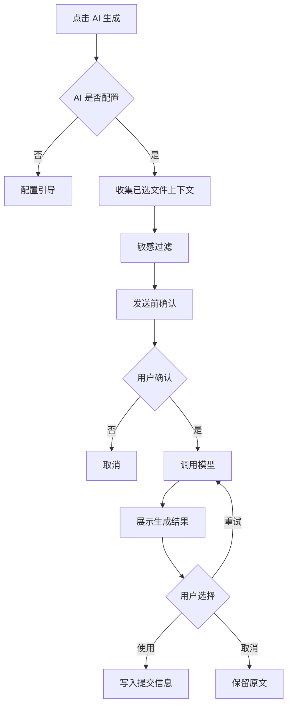
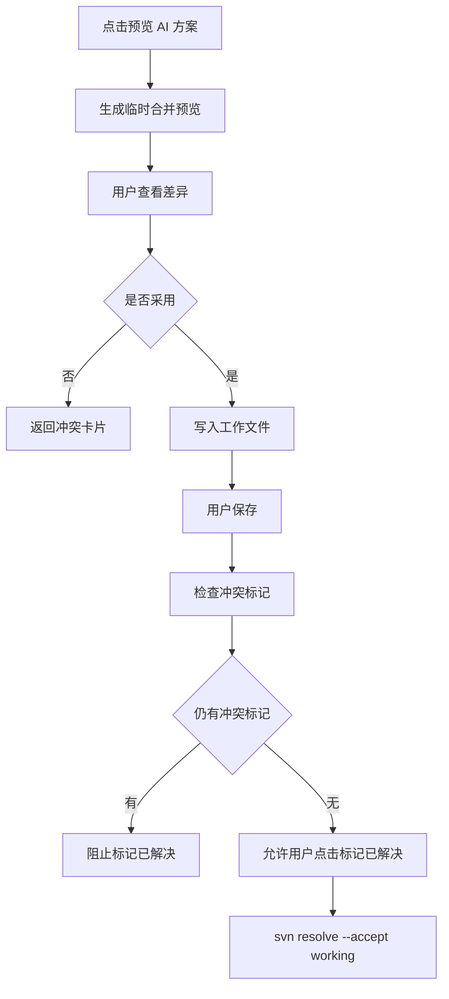

# SVN Workbench AI 交互设计文档

> 产品暂名：SVN Workbench for VS Code / SVN 工作台  
> 文档类型：设计阶段 AI 交互规格  
> 编写日期：2026-07-04  
> 当前阶段：设计阶段  
> 适用平台：Windows / macOS 标准统一  
> 文档策略：新增文件，不覆盖旧文档

## 1. 页面目标

AI 交互设计的目标不是“让 AI 替用户操作 SVN”，而是：

```text
让 AI 帮用户理解变更、筛选文件、发现风险、生成方案，用户做最终决策。
```

第一版 AI 重点服务 4 个高频痛点：

1. 提交说明不会写。
2. 不确定哪些文件该提交。
3. 容易误提交生成物、日志、缓存、敏感配置。
4. 冲突看不懂，不知道该保留哪边。

## 2. 设计原则

### 2.1 AI 默认不启用

首次使用 AI 时必须配置模型和隐私级别。

默认：

```text
AI 关闭
```

### 2.2 AI 不直接执行写操作

AI 不能直接执行：

- commit。
- update。
- revert。
- remove。
- resolve。
- lock/unlock。
- propset。
- 强制解锁。

AI 只能生成：

- 建议。
- 草案。
- 解释。
- 操作计划。
- 合并候选方案。

### 2.3 AI 输出必须可解释

每个 AI 建议必须包含：

- 推荐结论。
- 原因。
- 可信度。
- 风险。
- 影响文件。

不允许只显示：

```text
AI 建议提交
```

必须显示：

```text
AI 建议提交：该文件位于当前订单模块，diff 显示新增筛选逻辑，与提交摘要匹配。
```

### 2.4 AI 不突破 OperationScope

AI 输出中的文件路径必须经过 OperationScope 校验。

如果 AI 推荐范围外文件：

```text
已忽略 2 个范围外 AI 建议。当前操作来源是“提交此文件夹”，不能包含其他目录。
```

### 2.5 Windows/macOS 标准统一

AI 页面、按钮、流程、隐私确认、错误提示在 Windows/macOS 上完全一致。

平台差异只允许出现在：

- 本地模型连接。
- 外部工具。
- 路径显示。

## 3. AI 总入口

### 3.1 全局入口

位置：

- SVN 工作台侧边栏。
- 提交页。
- 冲突中心。
- 更新页。
- 历史页。
- 命令面板。

统一名称：

```text
SVN 智能助手
```

### 3.2 命令清单

```text
SVN: 配置智能助手
SVN: AI 生成提交说明
SVN: AI 筛选提交文件
SVN: AI 检查提交风险
SVN: AI 分析冲突
SVN: AI 总结远端更新
SVN: AI 生成忽略规则
```

### 3.3 状态入口

未配置 AI 时，所有 AI 按钮显示可点击状态，但点击后进入配置引导。

按钮文案不变：

```text
AI 筛选
AI 生成
AI 分析冲突
```

点击后统一弹出：

```text
尚未配置 SVN 智能助手
```

## 4. 首次启用流程

### 4.1 触发

用户首次点击任一 AI 功能。

### 4.2 弹窗线框

```text
┌────────────────────────────────────────────┐
│ 启用 SVN 智能助手                          │
├────────────────────────────────────────────┤
│ AI 可以帮助你生成提交说明、筛选提交文件、  │
│ 分析冲突和总结远端更新。                  │
│                                            │
│ 发送给模型的内容可能包含代码片段。        │
│ 请先选择模型来源并确认隐私级别。          │
├────────────────────────────────────────────┤
│ [配置模型] [仅使用本地规则] [暂不启用]     │
└────────────────────────────────────────────┘
```

### 4.3 按钮行为

| 按钮 | 行为 |
| --- | --- |
| 配置模型 | 打开 AI 模型设置页 |
| 仅使用本地规则 | 不调用模型，只使用生成物/敏感文件规则 |
| 暂不启用 | 关闭弹窗 |

## 5. AI 模型设置页

### 5.1 页面目标

让用户能配置国产模型、本地模型或企业内网模型，并明确隐私边界。

### 5.2 页面线框

```text
┌────────────────────────────────────────────────────┐
│ SVN 智能助手                                       │
├────────────────────────────────────────────────────┤
│ 启用 AI： [开关]                                   │
│                                                    │
│ 模型来源                                           │
│ ○ DeepSeek                                         │
│ ○ 通义千问 / 阿里云百炼                            │
│ ○ 智谱 GLM / Z.ai                                  │
│ ○ Kimi / Moonshot                                  │
│ ○ 腾讯混元                                         │
│ ○ 百度千帆                                         │
│ ○ Ollama 本地模型                                  │
│ ○ OpenAI-compatible 自定义                         │
│ ○ VS Code Language Model                           │
├────────────────────────────────────────────────────┤
│ 连接配置                                           │
│ Base URL:  ______________________________           │
│ API Key:   ********______________________           │
│ Model:     ______________________________           │
│                                                    │
│ [测试连接] [保存配置]                              │
├────────────────────────────────────────────────────┤
│ 默认用途                                           │
│ ☑ 提交说明   ☑ 文件筛选   ☑ 风险审查              │
│ ☑ 冲突分析   ☐ 更新总结   ☐ 日志总结              │
├────────────────────────────────────────────────────┤
│ 隐私级别                                           │
│ ○ 只发送文件名、路径和状态                         │
│ ● 发送变更摘要                                     │
│ ○ 发送选中文件 diff                                │
│ ○ 发送完整当前范围 diff                            │
│                                                    │
│ ☑ 每次发送前确认                                   │
│ ☐ 允许发送敏感文件内容                             │
└────────────────────────────────────────────────────┘
```

### 5.3 Provider 选择规则

每个 Provider 展示：

- 名称。
- 类型标签。
- 是否需要 API Key。
- 是否本地。
- 是否企业友好。

标签示例：

```text
中文强
代码强
长上下文
本地离线
企业网关
OpenAI-compatible
```

### 5.4 连接测试

点击 `测试连接` 后：

```text
正在测试模型连接...
```

成功：

```text
连接成功：模型可用
响应时间：1.2s
```

失败：

```text
连接失败：API Key 无效或模型不可用
```

按钮：

- 查看错误详情。
- 重新测试。
- 打开输出。

### 5.5 保存规则

保存前校验：

- Base URL 不为空。
- Model 不为空。
- Provider 需要 API Key 时必须填写。
- 隐私级别已选择。

保存位置：

- API Key 使用 SecretStorage。
- 非敏感配置使用 VS Code settings/globalState。

## 6. 隐私级别交互

### 6.1 隐私级别定义

| 级别 | 发送内容 | 默认 |
| --- | --- | --- |
| 最小 | 文件名、路径、SVN 状态、大小 | 否 |
| 摘要 | 文件状态 + diff 统计 + 本地规则结果 | 是 |
| 片段 | 选中文件的 diff 片段 | 否 |
| 完整 | 当前范围完整 diff | 否 |

### 6.2 敏感文件

默认不发送内容：

- `.env`
- `.env.*`
- `*.key`
- `*.pem`
- `*.pfx`
- `*.crt`
- `*.cer`
- `id_rsa`
- `id_ed25519`
- 包含 `password`、`secret`、`token` 的文件。

### 6.3 发送前确认弹窗

```text
┌────────────────────────────────────────────┐
│ 确认发送给 AI                              │
├────────────────────────────────────────────┤
│ 功能：AI 筛选提交文件                      │
│ 范围：src/pages/order                      │
│ 模型：OpenAI-compatible / qwen-coder       │
│ 隐私级别：发送变更摘要                    │
│                                            │
│ 文件数：12                                 │
│ Diff 字符数：8,420                         │
│ 敏感文件：0                                │
│ 二进制文件：1，仅发送文件名和大小          │
├────────────────────────────────────────────┤
│ [发送] [改为只发送文件名] [查看详情] [取消]│
└────────────────────────────────────────────┘
```

### 6.4 查看详情

展示即将发送的内容摘要：

```text
将发送：
- src/pages/order/OrderList.vue: diff 摘要
- src/pages/order/api.ts: diff 摘要
- src/pages/order/assets/icon.png: 文件名和大小

不会发送：
- .env.local: 敏感文件
```

## 7. AI 提交说明交互

### 7.1 入口

提交页底部：

```text
AI 生成
```

### 7.2 流程



### 7.3 结果卡片

```text
┌────────────────────────────────────────────┐
│ AI 生成的提交说明                          │
├────────────────────────────────────────────┤
│ 需求: 完成订单列表筛选                     │
│                                            │
│ 关联: TASK-123                             │
│ 范围: 订单模块                             │
│ 说明:                                      │
│ - 新增订单状态筛选                         │
│ - 调整接口参数映射                         │
│ - 更新页面样式                             │
├────────────────────────────────────────────┤
│ [使用此说明] [更简洁] [更详细] [重新生成]  │
└────────────────────────────────────────────┘
```

### 7.4 快速改写

按钮：

- 更简洁。
- 更详细。
- 改成缺陷修复。
- 改成需求开发。
- 只保留第一行。
- 加上影响范围。

## 8. AI 提交文件筛选交互

### 8.1 入口

提交页顶部：

```text
AI 筛选
```

### 8.2 结果总览

```text
┌────────────────────────────────────────────┐
│ AI 筛选结果                                │
│ 范围：src/pages/order                      │
├──────────┬──────────┬──────────┬──────────┤
│ 推荐提交 │ 建议排除 │ 需要确认 │ 阻止提交 │
│ 8        │ 6        │ 2        │ 1        │
└──────────┴──────────┴──────────┴──────────┘
```

### 8.3 文件建议列表

```text
推荐提交
☑ OrderList.vue
  原因：当前模块源码，新增筛选逻辑，与需求摘要匹配。
  可信度：高

建议排除
☐ debug.log
  原因：日志文件，不应进入版本库。
  可信度：高

需要确认
☐ assets/icon.png
  原因：图片资源无法文本 diff，请确认是否为本次需求新增。
  可信度：中

阻止提交
⛔ conflict.ts
  原因：文件存在未解决冲突。
```

### 8.4 操作按钮

- 应用推荐选择。
- 仅显示推荐提交。
- 逐个确认风险文件。
- 生成忽略规则草案。
- 重新分析。
- 关闭。

### 8.5 应用推荐选择

点击后显示确认：

```text
应用 AI 推荐？

将勾选 8 个推荐文件。
将取消 6 个建议排除文件。
2 个需要确认文件保持不变。
1 个阻止文件不会被勾选。
```

按钮：

- 应用。
- 取消。

规则：

- 不影响 OperationScope 外文件。
- 不取消固定选择文件。
- 不勾选阻止文件。
- 不自动提交。

## 9. AI 提交风险审查交互

### 9.1 入口

- 提交页 `提交前检查` 中可触发。
- 提交页独立按钮 `AI 风险审查`，后续可放入更多菜单。

### 9.2 结果面板

```text
AI 风险审查

高风险
- config/prod.yaml 修改了生产接口地址，请确认是否应提交。

中风险
- package-lock.json 有变化，但 package.json 未变化。
- 新增 1 个 SQL 文件，建议补充数据库变更说明。

低风险
- 包含 2 个图片资源，无法进行文本 diff。
```

### 9.3 操作

- 标记已确认。
- 从提交中移除。
- 查看 Diff。
- 重新分析。

风险项未确认时：

- 不一定阻止提交。
- 但提交确认弹窗必须显示。

## 10. AI 忽略规则草案交互

### 10.1 入口

- AI 筛选结果中的 `生成忽略规则草案`。
- 未版本控制文件列表中的 `AI 生成忽略规则`。

### 10.2 草案面板

```text
AI 建议加入 svn:ignore

当前目录：src/pages/order

建议规则：
dist
*.log
*.tmp

影响文件：
- dist/order.bundle.js
- debug.log
- temp.tmp
```

### 10.3 操作

- 应用到当前目录。
- 只在本次提交排除。
- 编辑规则。
- 取消。

### 10.4 已版本控制文件提示

如果文件已经被 SVN 跟踪：

```text
这些文件已经被 SVN 跟踪，加入 svn:ignore 不会让它们消失。
如需从版本库移除但保留本地，需要单独执行 remove --keep-local。
```

按钮：

- 查看说明。
- 不处理。

第一版不自动执行 `remove --keep-local`。

## 11. AI 冲突分析交互

### 11.1 入口

- 冲突中心文件行。
- 提交页冲突文件行。
- 更新结果冲突提示。

按钮：

```text
AI 分析冲突
```

### 11.2 MVP 布局

```text
┌──────────────────────────────────────────────────────────┐
│ 冲突文件：src/pages/order/OrderList.vue                  │
├────────────────────────────────┬─────────────────────────┤
│ VS Code Diff / 文件内容         │ AI 冲突决策卡片          │
│                                │                         │
│ <<<<<<< mine                   │ 冲突摘要                 │
│ ...                            │ 字段 status/state 冲突   │
│ =======                        │                         │
│ ...                            │ 我的修改意图             │
│ >>>>>>> theirs                 │ 新增多选筛选             │
│                                │                         │
│                                │ 远端修改意图             │
│                                │ 重命名状态字段           │
│                                │                         │
│                                │ AI 建议                  │
│                                │ 保留多选逻辑，使用 state │
│                                │                         │
│                                │ 风险                     │
│                                │ 确认后端是否支持 state   │
│                                │                         │
│                                │ [采用我的] [采用远端]    │
│                                │ [预览 AI 方案] [手动编辑]│
└────────────────────────────────┴─────────────────────────┘
```

### 11.3 AI 输出内容

必须包括：

- 冲突摘要。
- 我的修改意图。
- 远端修改意图。
- 冲突点。
- 推荐处理方案。
- 风险。
- 合并候选方案。

### 11.4 采用 AI 方案流程



### 11.5 冲突决策按钮

| 按钮 | 行为 |
| --- | --- |
| 采用我的 | 使用 mine 内容，需确认 |
| 采用远端 | 使用 theirs 内容，需确认 |
| 预览 AI 方案 | 生成临时预览，不立即覆盖 |
| 应用 AI 方案 | 预览后可用，写入工作文件 |
| 手动编辑 | 打开工作文件 |
| 用外部工具打开 | 可选增强，放更多菜单 |

### 11.6 安全确认

采用我的：

```text
确认采用我的版本？
这会丢弃远端在该冲突块中的修改。
```

采用远端：

```text
确认采用远端版本？
这会丢弃你在该冲突块中的修改。
```

应用 AI 方案：

```text
确认应用 AI 合并方案？
AI 方案已写入预览，请确认内容正确后再应用。
```

## 12. AI 智能更新建议交互

### 12.1 入口

- 工作台远端更新卡片。
- 更新页。
- 提交页检查远端后。

### 12.2 结果

```text
远端有 16 个变更

建议立即更新：6
可稍后更新：7
风险更新：3
阻止更新：0
```

### 12.3 风险更新详情

```text
⚠ OrderList.vue
原因：本地已修改，远端也修改了同一文件，可能产生冲突。

建议：
先查看远端差异，或提交/备份本地修改后更新。
```

### 12.4 操作

- 更新推荐项。
- 更新当前范围。
- 更新全部。
- 查看风险。
- 取消。

选择性更新前提示：

```text
选择性更新可能让工作副本进入 mixed revision 状态。
```

## 13. AI 日志总结交互

### 13.1 入口

- 历史页。
- 远端更新页。
- 状态栏远端更新 QuickPick。

### 13.2 输出

```text
最近 12 个远端提交总结

与你当前修改相关：
- r12878 修改了订单筛选逻辑，建议更新前查看。

配置变更：
- r12880 修改了生产超时配置。

可稍后关注：
- 用户模块文案调整。
```

### 13.3 操作

- 查看相关修订。
- 对比当前文件。
- 生成更新建议。

## 14. AI 错误状态

### 14.1 未配置

```text
尚未配置 SVN 智能助手。
```

按钮：

- 配置模型。
- 仅使用本地规则。

### 14.2 连接失败

```text
AI 模型连接失败。
```

可能原因：

- Base URL 不正确。
- API Key 无效。
- 网络不可达。
- 模型名不存在。

按钮：

- 重试。
- 打开模型设置。
- 查看输出。

### 14.3 输出格式错误

```text
AI 返回内容无法解析。
```

按钮：

- 重新生成。
- 查看原始输出。
- 改用本地规则。

### 14.4 超时

```text
AI 响应超时。
```

按钮：

- 重试。
- 切换模型。
- 减少发送内容。

### 14.5 敏感内容阻止

```text
当前请求包含敏感文件内容，已阻止发送。
```

按钮：

- 改为只发送文件名。
- 查看敏感文件。
- 取消。

## 15. AI 加载与取消

### 15.1 加载状态

```text
AI 正在分析...
```

显示：

- 当前模型。
- 已发送文件数。
- 可取消按钮。

### 15.2 流式输出

支持流式时：

- 先显示摘要。
- 再逐步显示文件建议。
- 用户可中途取消。

取消后：

```text
AI 分析已取消，未应用任何结果。
```

## 16. AI 结果校验

所有 AI 结果进入 UI 前必须校验：

1. JSON 是否可解析。
2. 必填字段是否存在。
3. 文件路径是否在 OperationScope 内。
4. 文件路径是否属于候选集合。
5. 是否尝试执行危险操作。
6. 是否包含敏感内容回显。
7. 合并方案是否仍含冲突标记。

校验失败：

```text
AI 结果存在不安全内容，已阻止应用。
```

## 17. AI 结果可信度设计

### 17.1 可信度标签

| 可信度 | UI |
| --- | --- |
| 高 | 绿色 |
| 中 | 黄色 |
| 低 | 灰色 |
| 阻止 | 红色 |

### 17.2 判断来源

可信度由两部分组成：

- 本地规则。
- AI 判断。

示例：

```text
高可信：本地规则和 AI 都判断为生成物。
中可信：AI 判断可能相关，但本地规则无法确认。
低可信：上下文不足，需要用户判断。
```

## 18. AI 与本地规则的关系

### 18.1 本地规则优先

本地规则阻止的文件，AI 不能改为可提交。

例：

- 冲突文件。
- 他人锁定文件。
- OperationScope 外文件。

### 18.2 AI 可补充解释

本地规则排除的生成物，AI 可以解释：

```text
dist/app.js 是构建产物，通常应由构建流程生成，不建议提交。
```

### 18.3 AI 可建议新规则

例如：

```text
检测到多个 *.tmp 文件，建议加入 svn:ignore。
```

但必须用户确认。

## 19. 数据结构草案

### 19.1 AiRequestContext

```ts
interface AiRequestContext {
  useCase: AiUseCase;
  scope: OperationScope;
  repository: RepositorySummary;
  privacyLevel: AiPrivacyLevel;
  files: AiFileContext[];
  userInput?: {
    ticket?: string;
    summary?: string;
    templateId?: string;
  };
}
```

### 19.2 AiFileDecision

```ts
interface AiFileDecision {
  path: string;
  decision: 'include' | 'exclude' | 'review' | 'block';
  confidence: 'high' | 'medium' | 'low';
  reason: string;
  risk?: string;
  matchedRules: string[];
}
```

### 19.3 AiConflictAdvice

```ts
interface AiConflictAdvice {
  path: string;
  summary: string;
  mineIntent: string;
  theirsIntent: string;
  conflictPoints: string[];
  suggestedResolution: string;
  risk: string;
  mergedCandidate?: string;
}
```

### 19.4 AiError

```ts
interface AiError {
  code:
    | 'notConfigured'
    | 'connectionFailed'
    | 'authFailed'
    | 'modelNotFound'
    | 'timeout'
    | 'invalidResponse'
    | 'privacyBlocked'
    | 'unsafeOutput';
  message: string;
  recoverActions: AiRecoverAction[];
}
```

## 20. 设计验收用例

### 20.1 模型配置

| 用例 | 预期 |
| --- | --- |
| 未配置点击 AI | 打开配置引导 |
| API Key 为空 | 不能保存需要 Key 的 Provider |
| 测试连接成功 | 显示成功和耗时 |
| 测试连接失败 | 显示原因和输出入口 |

### 20.2 隐私确认

| 用例 | 预期 |
| --- | --- |
| 发送前确认开启 | 每次显示摘要 |
| 请求包含敏感文件 | 默认不发送内容 |
| 用户选择只发送文件名 | 不发送 diff |
| 用户取消 | 不调用模型 |

### 20.3 AI 筛选

| 用例 | 预期 |
| --- | --- |
| AI 推荐提交 | 显示原因和可信度 |
| AI 建议排除 | 不自动取消，等待应用 |
| AI 返回范围外路径 | 忽略并提示 |
| 应用推荐 | 不影响固定选择和范围外文件 |

### 20.4 AI 冲突

| 用例 | 预期 |
| --- | --- |
| 分析冲突 | 显示 mine/theirs 意图 |
| 预览 AI 方案 | 不覆盖工作文件 |
| 应用 AI 方案 | 用户确认后写入 |
| 仍有冲突标记 | 不允许标记已解决 |

### 20.5 跨平台

| 用例 | Windows | macOS |
| --- | --- | --- |
| 模型配置 | 通过 | 通过 |
| 发送前确认 | 通过 | 通过 |
| AI 筛选 | 通过 | 通过 |
| AI 冲突决策卡片 | 通过 | 通过 |
| 本地 Ollama 连接 | 可配置 | 可配置 |

## 21. 当前设计决策

1. AI 默认关闭。
2. AI 模型接入优先 OpenAI-compatible。
3. 国产模型、本地模型、企业网关是一等入口。
4. AI 请求默认需要发送前确认。
5. AI 不直接执行 SVN 写操作。
6. AI 不突破 OperationScope。
7. AI 冲突处理第一版采用决策卡片，不自研完整三方合并器。
8. AI 输出必须经过结构化校验。
9. Windows/macOS 使用同一套 AI 交互。

## 22. 下一步

AI 交互设计完成后，设计阶段下一份文档建议写：

```text
2026-07-04-svn-workbench-operation-scope-interaction.md
```

重点细化：

- 文件、文件夹、多选、SCM 选择的范围创建。
- OperationScope 在提交、更新、AI、模板中的传递。
- 范围越界提示。
- 路径边界校验。
- Windows/macOS 统一验收。
