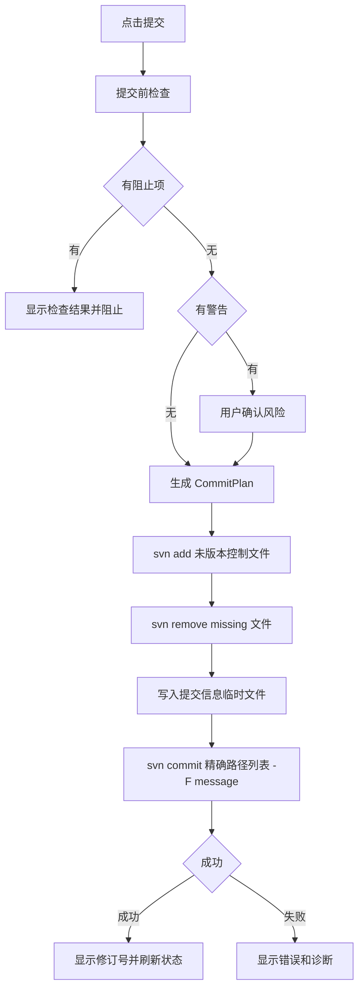

# SVN Workbench 提交页线框与交互规格

> 产品暂名：SVN Workbench for VS Code / SVN 工作台  
> 文档类型：设计阶段页面线框  
> 编写日期：2026-07-04  
> 当前阶段：设计阶段  
> 适用平台：Windows / macOS 标准统一  
> 文档策略：新增文件，不覆盖旧文档

## 1. 页面定位

提交页是 SVN Workbench 第一版最核心的页面。

它承担 6 件事：

1. 明确本次提交范围。
2. 展示当前范围内所有可提交候选文件。
3. 让用户高效筛选和勾选文件。
4. 自动排除生成物、日志、临时文件等低价值文件。
5. 通过 AI 帮助用户筛选、检查风险、生成提交说明。
6. 执行安全可控的 SVN 提交。

页面目标：

```text
让用户在不离开 VS Code 的情况下，清楚、安全、快速地完成一次 SVN 提交。
```

## 2. 平台统一原则

提交页在 Windows 和 macOS 上必须完全一致：

- 同一套布局。
- 同一套按钮。
- 同一套筛选器。
- 同一套 AI 交互。
- 同一套提交前检查。
- 同一套错误提示。
- 同一套验收标准。

平台差异只能在底层适配：

- SVN 可执行文件路径。
- 路径分隔符。
- 输出编码。
- 外部 diff/merge 工具。

提交页本身不出现两套平台逻辑。

## 3. 页面入口

| 入口 | 页面标题 | OperationScope |
| --- | --- | --- |
| 右键文件 `提交此文件` | 提交此文件 | 当前文件 |
| 右键文件夹 `提交此文件夹` | 提交此文件夹 | 当前文件夹及子目录 |
| SCM 面板 `提交` | 提交工作区变更 | 当前工作副本 |
| SCM 选中文件后 `提交选择` | 提交已选择文件 | SCM 选中文件 |
| 变更页 `提交选择` | 提交已选择文件 | 变更页选中文件 |
| 命令面板 `SVN: 提交当前文件` | 提交当前文件 | 当前编辑器文件 |
| 命令面板 `SVN: 提交工作区` | 提交工作区变更 | 当前工作副本 |

## 4. 线框总览

### 4.1 桌面宽屏布局

```text
┌──────────────────────────────────────────────────────────────────────────────┐
│ Header: 提交此文件夹  |  范围: src/pages/order  |  r12876  |  远端: 未检查   │
├──────────────────────────────────────────────────────────────────────────────┤
│ Summary: 候选 18 | 已选 9 | 已排除 6 | 需确认 2 | 阻止 1 | 总大小 248 KB     │
├──────────────────────────────────────────────────────────────────────────────┤
│ Toolbar: [刷新] [检查远端] [模板] [AI 筛选] [提交前检查] [只看已选] [更多]   │
├───────────────────────────────┬──────────────────────────────────────────────┤
│ Left: 文件选择区               │ Right: 差异预览区                            │
│ ┌───────────────────────────┐ │ ┌────────────────────────────────────────┐ │
│ │ FilterBar                 │ │ │ Diff Header                            │ │
│ │ 状态 类型 后缀 路径 搜索  │ │ │ OrderList.vue | Working vs BASE        │ │
│ ├───────────────────────────┤ │ ├────────────────────────────────────────┤ │
│ │ FileList                  │ │ │ - old line                              │ │
│ │ ☑ M OrderList.vue 推荐    │ │ │ + new line                              │ │
│ │ ☑ M api.ts 推荐           │ │ │                                        │ │
│ │ ☐ ? debug.log 排除        │ │ │                                        │ │
│ │ ☐ A icon.png 需确认       │ │ │                                        │ │
│ │ ⛔ C conflict.ts 阻止      │ │ │                                        │ │
│ └───────────────────────────┘ │ └────────────────────────────────────────┘ │
├──────────────────────────────────────────────────────────────────────────────┤
│ Commit Message: 类型 | 工单号 | 摘要 | 详细说明 | [AI 生成] [模板] [提交]   │
└──────────────────────────────────────────────────────────────────────────────┘
```

### 4.2 中等宽度布局

当宽度不足时：

```text
┌────────────────────────────────────────────┐
│ Header                                     │
├────────────────────────────────────────────┤
│ Toolbar                                    │
├────────────────────────────────────────────┤
│ Tabs: [文件] [差异] [AI 建议] [检查结果]   │
├────────────────────────────────────────────┤
│ 当前 Tab 内容                              │
├────────────────────────────────────────────┤
│ Commit Message                             │
└────────────────────────────────────────────┘
```

规则：

- 默认打开 `文件` Tab。
- 点击文件后自动切到 `差异` Tab，可配置。
- AI 筛选结果进入 `AI 建议` Tab。
- 提交前检查结果进入 `检查结果` Tab。

### 4.3 最小宽度降级

如果 Webview 宽度很窄：

- 左右分栏切为上下布局。
- Diff 默认折叠。
- 提交信息区仍固定在底部。
- 核心按钮不隐藏：`AI 筛选`、`提交前检查`、`提交`。

## 5. 页面区域

### 5.1 Header 区

内容：

```text
提交此文件夹
范围：src/pages/order 及其子目录
仓库：project-name
修订：r12876
URL：.../trunk/project
远端：未检查
```

控件：

- 复制 URL。
- 打开工作副本根目录。
- 查看范围详情。
- 切换仓库，仅多工作副本时显示。

状态：

- 正常。
- 非 SVN 工作副本。
- 多工作副本。
- externals 已排除。
- 嵌套工作副本已排除。

### 5.2 Summary 区

显示：

| 字段 | 说明 |
| --- | --- |
| 候选 | 当前 OperationScope 内 status 扫描出的候选数量 |
| 已选 | 用户最终勾选数量 |
| 已排除 | 规则或 AI 建议排除数量 |
| 需确认 | 大文件、二进制、敏感、普通 bin 等 |
| 阻止 | 冲突、他人锁定、越界、状态异常 |
| 总大小 | 已选文件大小合计 |

每个数字可点击筛选。

示例：

```text
候选 18 | 已选 9 | 已排除 6 | 需确认 2 | 阻止 1 | 总大小 248 KB
```

### 5.3 Toolbar 区

按钮：

| 按钮 | 行为 |
| --- | --- |
| 刷新 | 重新扫描当前 OperationScope |
| 检查远端 | 执行远端状态检查 |
| 更新并继续 | 有远端更新时显示 |
| 模板 | 打开模板选择器 |
| AI 筛选 | 打开 AI 筛选流程 |
| 提交前检查 | 不提交，只执行检查 |
| 只看已选 | 切换文件列表 |
| 显示排除 | 显示被规则排除的文件 |
| 更多 | 输出、设置、复制诊断 |

按钮禁用规则：

- SVN 正在执行写操作时禁用所有写相关按钮。
- 未配置 AI 时，`AI 筛选` 点击后进入 AI 设置引导。
- 有阻止项时，`提交` 禁用。

### 5.4 文件选择区

包含：

- FilterBar。
- QuickActions。
- FileList。
- 排除说明。

#### 5.4.1 FilterBar

控件：

```text
[状态] [类型] [后缀] [路径] [Changelist] [锁] [搜索框]
```

全部筛选只影响可见列表，不直接改变勾选。

#### 5.4.2 QuickActions

按钮：

- 全选可提交。
- 全选当前筛选。
- 清空选择。
- 反选当前筛选。
- 只选源码。
- 排除生成物。
- 排除二进制。
- 固定选择。

#### 5.4.3 FileList

列：

| 列 | 默认 | 说明 |
| --- | --- | --- |
| 选择 | 是 | 复选框 |
| 状态 | 是 | M/A/D/!/C/? |
| 文件名 | 是 | basename |
| 路径 | 是 | 相对路径 |
| 类型 | 是 | 前端源码、配置、图片等 |
| AI | 是 | 推荐、排除、需确认、阻止 |
| 风险 | 是 | 敏感、大文件、二进制、锁 |
| 大小 | 是 | 新增和二进制重点显示 |
| 锁 | 是 | 自己锁、他人锁、需要锁 |

行高度：

- 默认紧凑。
- 鼠标悬停显示行操作。

行操作：

- 打开。
- Diff。
- 历史。
- 还原。
- 忽略。
- 锁定/解锁。
- 固定选择。

### 5.5 差异预览区

默认显示当前选中文件的 diff。

模式：

- Working vs BASE。
- Working vs HEAD。
- Revision vs Revision，后续。

顶部控件：

- 比较模式下拉。
- 上一个变更。
- 下一个变更。
- 打开完整 Diff。
- 复制 Diff。
- 忽略空白。

空状态：

```text
选择左侧文件查看差异。
```

二进制文件：

```text
该文件无法进行文本差异预览。
文件类型：图片
大小：84 KB
[打开文件] [查看历史]
```

冲突文件：

```text
该文件存在冲突，不能提交。
[进入冲突中心] [AI 分析冲突]
```

### 5.6 AI 建议区

AI 建议可以作为：

- 提交页右侧抽屉。
- 中等宽度时的 Tab。
- 点击 `AI 筛选` 后的弹层。

推荐 MVP 使用右侧抽屉：

```text
┌──────────────────────────────┐
│ AI 筛选结果                  │
├──────────────────────────────┤
│ 推荐提交 8                   │
│ 建议排除 6                   │
│ 需要确认 2                   │
│ 阻止提交 1                   │
├──────────────────────────────┤
│ 推荐提交                     │
│ - OrderList.vue              │
│   当前模块源码，匹配需求     │
│                              │
│ 建议排除                     │
│ - debug.log                  │
│   日志文件，不建议提交       │
├──────────────────────────────┤
│ [应用推荐选择] [生成忽略规则] │
└──────────────────────────────┘
```

### 5.7 提交信息区

固定在底部。

字段：

| 字段 | 说明 |
| --- | --- |
| 类型 | 需求、缺陷、优化、重构、配置、文档、发布 |
| 工单号 | 可选或按规则必填 |
| 摘要 | 第一行提交说明 |
| 详细说明 | 多行说明 |
| 保留锁 | 提交后是否保留锁 |

按钮：

- AI 生成。
- 模板。
- 最近提交。
- 清空。
- 提交。

提交按钮区域显示：

```text
将提交 9 个文件
```

有警告时：

```text
有 2 个风险项，提交前需要确认
```

## 6. OperationScope 展示

### 6.1 文件夹提交示例

用户右键：

```text
src/pages/order
```

页面显示：

```text
提交此文件夹
范围：src/pages/order 及其子目录
```

范围详情：

```text
来源：Explorer 右键文件夹
包含：src/pages/order/**
排除：嵌套工作副本、externals
允许扩大范围：否
```

### 6.2 多选范围示例

用户选中：

```text
src/pages/order
src/common/request.ts
```

页面显示：

```text
提交已选择范围
范围：2 个路径
```

范围详情列出每个 root。

### 6.3 范围越界提示

如果 AI、模板或搜索尝试加入范围外文件：

```text
已忽略 3 个范围外文件。当前提交来源是“提交此文件夹”，不能包含其他目录。
```

提供：

- 查看被忽略文件。
- 打开变更页查看全局变更。

## 7. 文件状态设计

| SVN 状态 | 显示 | 默认勾选 | 是否可提交 |
| --- | --- | --- | --- |
| Modified | M | 是 | 是 |
| Added | A | 是 | 是 |
| Deleted | D | 是 | 是 |
| Missing | ! | 是，需确认 | 是，需 svn remove |
| Unversioned | ? | 否 | 需 svn add |
| Conflicted | C | 否 | 否 |
| Ignored | I | 否 | 否 |
| External | X | 否 | 可配置 |
| Obstructed | ~ | 否 | 否 |
| Locked | L | 视情况 | 视锁状态 |

## 8. 文件类型设计

### 8.1 默认类型

| 类型 | 后缀 |
| --- | --- |
| 前端源码 | `.js`、`.jsx`、`.ts`、`.tsx`、`.vue`、`.svelte` |
| 样式 | `.css`、`.scss`、`.less`、`.sass`、`.styl` |
| 后端源码 | `.java`、`.kt`、`.cs`、`.go`、`.py`、`.php`、`.rb` |
| 配置 | `.json`、`.yaml`、`.yml`、`.xml`、`.ini`、`.properties`、`.toml` |
| 文档 | `.md`、`.txt`、`.docx`、`.xlsx`、`.pdf` |
| 图片 | `.png`、`.jpg`、`.jpeg`、`.gif`、`.webp`、`.svg`、`.ico` |
| 数据库 | `.sql`、`.db`、`.sqlite` |
| 脚本 | `.sh`、`.bat`、`.cmd`、`.ps1` |
| 二进制 | 无法文本 diff 或常见二进制格式 |
| 其他 | 未归类 |

### 8.2 类型筛选交互

类型下拉：

```text
文件类型
☑ 前端源码 6
☑ 样式 2
☐ 图片 3
☐ 配置 1
```

行为：

- 勾选类型只过滤可见文件。
- 不直接修改提交勾选。
- 点击 `全选当前筛选` 才改变勾选。

## 9. 生成物排除设计

### 9.1 默认排除

默认建议排除：

```text
node_modules/**
dist/**
build/**
.next/**
.nuxt/**
target/**
bin/Debug/**
bin/Release/**
obj/**
__pycache__/**
*.log
*.tmp
```

### 9.2 普通 bin 规则

不一刀切排除：

```text
bin/**
```

规则：

- `bin/Debug/**` 排除。
- `bin/Release/**` 排除。
- `bin/deploy.sh` 需确认。
- `bin/tool.ps1` 需确认。
- `bin/readme.md` 需确认。

### 9.3 排除展示

被排除文件默认折叠：

```text
已根据规则排除 6 个文件
[显示]
```

展开后：

```text
debug.log       日志文件
dist/app.js     构建产物
obj/cache.bin   .NET 构建中间产物
```

每行有：

- 本次仍要提交。
- 加入忽略规则。
- 不再提醒。

## 10. 筛选器详细设计

### 10.1 状态筛选

快捷标签：

```text
全部 18 | M 6 | A 2 | D 1 | ! 1 | ? 6 | C 1
```

点击标签切换筛选。

### 10.2 后缀筛选

标签云：

```text
.vue 3  .ts 4  .scss 2  .json 1  .png 3  .log 2
```

点击 `.vue` 只显示 `.vue`。

### 10.3 路径筛选

目录树：

```text
src/pages/order
  components
  api
  styles
```

规则：

- 根节点就是 OperationScope。
- 用户不能选择范围外目录。

### 10.4 搜索语法

支持：

```text
ext:vue
type:config
status:modified
path:components
size:>1MB
ai:recommended
risk:sensitive
lock:mine
```

搜索结果只影响可见列表。

## 11. 模板交互

### 11.1 模板入口

按钮：

```text
模板
```

下拉：

- 需求开发。
- 缺陷修复。
- 前端页面。
- 后端接口。
- 配置调整。
- 文档更新。
- 样式资源。
- 数据库脚本。
- 发布打包。

### 11.2 模板应用弹窗

选择模板后：

```text
“前端页面”模板匹配当前范围内 7 个文件，另有 3 个文件不匹配。
```

按钮：

- 勾选匹配文件。
- 仅显示匹配文件。
- 只填提交信息。
- 取消。

默认：

```text
只填提交信息
```

避免模板误改用户选择。

### 11.3 手动选择保护

如果用户已手动勾选：

```text
检测到你已手动选择 5 个文件，是否保留这些选择？
```

默认：

```text
保留手动选择
```

## 12. AI 筛选流程

### 12.1 未配置 AI

点击 `AI 筛选`：

```text
尚未配置 SVN 智能助手。
```

按钮：

- 配置模型。
- 仅使用本地规则。
- 取消。

### 12.2 发送前确认

```text
即将发送给 AI：

范围：src/pages/order
文件数：12
Diff 字符数：8,420
敏感文件：0
二进制文件：1 个，仅发送文件名
模型：OpenAI-compatible / your-model
```

按钮：

- 发送。
- 改为只发送摘要。
- 查看详情。
- 取消。

### 12.3 AI 分析中

显示：

```text
AI 正在分析当前提交范围...
```

可取消。

### 12.4 AI 结果

分类：

- 推荐提交。
- 建议排除。
- 需要确认。
- 阻止提交。

每项必须有：

- 文件。
- 决策。
- 可信度。
- 原因。
- 风险。

### 12.5 应用结果

按钮：

- 应用推荐选择。
- 只显示推荐提交。
- 逐个确认风险文件。
- 生成忽略规则草案。

应用规则：

- 只影响 OperationScope 内文件。
- 不取消固定选择。
- 不勾选阻止文件。
- 敏感文件仍需确认。

## 13. 提交前检查设计

### 13.1 检查项

点击 `提交前检查` 或 `提交` 时执行：

1. 是否有已选文件。
2. 提交信息是否为空。
3. 当前范围内是否有冲突文件被选中。
4. 是否有阻止项。
5. 是否有远端更新。
6. 是否有未版本控制文件需要 add。
7. 是否有 missing 文件需要 remove。
8. 是否有敏感文件。
9. 是否有大文件。
10. 是否有他人锁定文件。
11. 是否有 externals。
12. 最终提交路径是否都在 OperationScope 内。

### 13.2 检查结果面板

```text
提交前检查

阻止 1
- conflict.ts 存在冲突，请先解决

警告 2
- icon.png 是二进制文件，无法文本 diff
- config/prod.yaml 修改了生产配置

准备操作
- svn add: 2 个文件
- svn remove: 1 个文件
- svn commit: 9 个文件
```

按钮：

- 修复阻止项。
- 继续提交，只有无阻止项时显示。
- 取消。

### 13.3 提交确认

有警告时：

```text
确认提交？

将提交 9 个文件。
包含 2 个需要确认的风险项。
```

按钮：

- 确认提交。
- 返回修改。

## 14. 提交流程



## 15. 提交成功状态

```text
提交成功

修订号：r12880
提交文件：9 个
耗时：4.2s
```

按钮：

- 查看日志。
- 复制提交摘要。
- 关闭。

复制摘要：

```text
r12880 需求: 完成订单筛选
提交文件：9 个
```

## 16. 提交失败状态

### 16.1 认证失败

```text
提交失败：认证失败

SVN 拒绝了当前凭据，请换账号后重试。
```

按钮：

- 打开认证管理。
- 重试。
- 打开输出。

### 16.2 Out of date

```text
提交失败：远端已有更新

当前文件不是最新版本，建议先更新并解决可能的冲突。
```

按钮：

- 更新并继续。
- 查看远端更新。
- 取消。

### 16.3 冲突

```text
提交失败：存在冲突
```

按钮：

- 进入冲突中心。
- 打开输出。

### 16.4 路径异常

```text
提交失败：文件路径状态异常
```

按钮：

- 刷新状态。
- 查看诊断。

## 17. 空状态

### 17.1 当前范围无变更

```text
当前范围没有可提交变更。
```

按钮：

- 查看工作区其他变更。
- 检查远端。
- 关闭。

### 17.2 全部被过滤

```text
当前筛选条件下没有文件。
```

按钮：

- 清空筛选。
- 显示被排除文件。

### 17.3 AI 无建议

```text
AI 没有发现额外建议。
当前选择看起来是合理的。
```

## 18. 键盘与效率设计

快捷键建议：

| 快捷键 | 行为 |
| --- | --- |
| `Ctrl/Cmd + Enter` | 提交，需通过检查 |
| `Ctrl/Cmd + F` | 聚焦搜索 |
| `Space` | 切换当前文件勾选 |
| `Enter` | 打开 Diff |
| `Esc` | 关闭弹层 |
| `Alt + A` | AI 筛选 |

快捷键必须遵循平台统一：

- Windows 用 Ctrl。
- macOS 用 Cmd。
- 文档统一写 `Ctrl/Cmd`。

## 19. 状态机

```text
initializing
  -> loadingStatus
  -> ready
  -> aiAnalyzing
  -> ready
  -> checking
  -> ready
  -> committing
  -> success
  -> failed
```

状态说明：

| 状态 | 页面表现 |
| --- | --- |
| initializing | 初始化 OperationScope |
| loadingStatus | 扫描 SVN 状态 |
| ready | 可操作 |
| aiAnalyzing | AI 分析中，可取消 |
| checking | 提交前检查中 |
| committing | 提交中，禁止修改选择 |
| success | 提交成功 |
| failed | 提交失败 |

## 20. 数据结构草案

### 20.1 CommitPageState

```ts
interface CommitPageState {
  scope: OperationScope;
  repository: RepositorySummary;
  items: CommitFileItem[];
  filters: CommitFilters;
  selection: CommitSelection;
  ai?: AiCommitAdviceState;
  check?: CommitCheckResult;
  message: CommitMessageDraft;
  ui: CommitPageUiState;
}
```

### 20.2 CommitFileItem

```ts
interface CommitFileItem {
  id: string;
  absolutePath: string;
  relativePath: string;
  svnStatus: SvnStatus;
  fileType: FileTypeCategory;
  extension: string;
  size?: number;
  selected: boolean;
  fixedSelected: boolean;
  excludedByRule: boolean;
  generatedKind?: string;
  sensitive: boolean;
  binary: boolean;
  lock?: SvnLockInfo;
  aiDecision?: AiFileDecision;
  blockers: CommitBlocker[];
  warnings: CommitWarning[];
}
```

### 20.3 CommitFilters

```ts
interface CommitFilters {
  statuses: SvnStatus[];
  fileTypes: FileTypeCategory[];
  extensions: string[];
  pathQuery?: string;
  searchQuery?: string;
  showSelectedOnly: boolean;
  showExcluded: boolean;
  aiDecision?: 'recommended' | 'excluded' | 'review' | 'blocked';
}
```

### 20.4 CommitCheckResult

```ts
interface CommitCheckResult {
  blockers: CommitBlocker[];
  warnings: CommitWarning[];
  plannedAdds: string[];
  plannedRemoves: string[];
  finalCommitPaths: string[];
  remoteStatus: 'unknown' | 'clean' | 'hasUpdates' | 'failed';
}
```

## 21. 技术验证关联

提交页设计要求技术验证阶段优先验证：

1. OperationScope 能严格限制文件夹范围。
2. `svn status --xml <folder>` 返回可解析状态。
3. 生成物规则能在 Windows/macOS 一致运行。
4. `svn add` 能处理未版本控制文件。
5. `svn remove` 能处理 missing 文件。
6. `svn commit <files> -F <message-file>` 能处理中文提交信息。
7. VS Code diff 能打开 BASE/Working 对比。
8. AI 输出路径能被 OperationScope 校验。

## 22. 验收用例

### 22.1 右键文件夹提交

| 用例 | 预期 |
| --- | --- |
| 右键 `src/pages/order` | 只显示该目录内文件 |
| 清空筛选 | 仍只显示该目录内文件 |
| 点击全选 | 只选该目录内文件 |
| 选择模板 | 只匹配该目录内文件 |
| AI 推荐 | 不推荐范围外文件 |
| 最终提交 | commit 路径全在该目录内 |

### 22.2 文件筛选

| 用例 | 预期 |
| --- | --- |
| 点击 `.vue` | 只过滤显示，不自动勾选 |
| 点击 `全选当前筛选` | 勾选当前可见 `.vue` |
| 点击 `显示排除` | 显示生成物和日志 |
| 点击 `排除二进制` | 取消图片/Office/压缩包选择 |

### 22.3 AI 筛选

| 用例 | 预期 |
| --- | --- |
| 未配置 AI 点击 AI 筛选 | 进入配置引导 |
| 发送前确认取消 | 不发送任何内容 |
| AI 返回范围外路径 | 被忽略并提示 |
| 应用 AI 推荐 | 只修改当前范围内选择 |
| 固定选择文件 | 不被 AI 取消 |

### 22.4 提交前检查

| 用例 | 预期 |
| --- | --- |
| 无提交信息 | 阻止 |
| 有冲突文件 | 阻止 |
| 有他人锁定 | 阻止 |
| 有敏感文件 | 警告并确认 |
| 有 missing 文件 | 提示将提交删除 |
| 有 `?` 文件 | 提交前计划 svn add |

### 22.5 跨平台

| 用例 | Windows | macOS |
| --- | --- | --- |
| 中文提交说明 | 通过 | 通过 |
| 空格路径 | 通过 | 通过 |
| 右键文件夹范围 | 通过 | 通过 |
| VS Code diff | 通过 | 通过 |
| AI 筛选 | 通过 | 通过 |

## 23. 当前设计决策

1. 提交页使用 Webview 实现。
2. 提交页 Windows/macOS 完全同一标准。
3. 右键文件夹提交必须显示范围，并且不能扩大范围。
4. 类型、后缀、路径、搜索筛选只影响可见列表，不直接改变勾选。
5. 模板默认只填提交信息，不自动覆盖用户选择。
6. AI 默认只建议，用户点击应用后才改变选择。
7. 提交前检查必须显示最终 SVN 操作计划。
8. 提交命令使用精确路径列表和 `-F` 提交信息临时文件。
9. MVP 使用 VS Code diff，不自研复杂差异面板。

## 24. 下一步

提交页线框完成后，设计阶段下一份文档建议写：

```text
2026-07-04-svn-workbench-ai-interaction-design.md
```

重点细化：

- AI 模型设置页。
- AI 发送前确认。
- AI 筛选结果卡片。
- AI 冲突决策卡片。
- AI 错误状态。
- AI 输出结构校验。
