# SVN Workbench 从 0 到 1 产品流程化总文档

> 产品暂名：SVN Workbench for VS Code / SVN 工作台  
> 文档类型：从 0 到 1 流程化总文档  
> 编写日期：2026-07-04  
> 当前阶段：产品设计与技术落地总纲  
> 文档策略：新增文件，不覆盖旧文档

## 1. 文件夹与命名规范

### 1.1 当前文件夹

当前总文档放在：

```text
docs/2026-07-04-svn-workbench-from-zero-to-one/
```

命名含义：

- `2026-07-04`：文档创建日期。
- `svn-workbench`：产品英文标识，统一小写中划线。
- `from-zero-to-one`：文档主题，表示从 0 到 1 的总流程。

### 1.2 当前主文档

当前主文档文件名：

```text
2026-07-04-svn-workbench-from-zero-to-one-flow.md
```

命名含义：

- `2026-07-04`：创建日期。
- `svn-workbench`：产品英文标识。
- `from-zero-to-one-flow`：文档类型，表示从产品、设计、技术到发布的流程化说明。

### 1.3 后续新增文档命名

所有后续文档都新增，不直接覆盖旧文档。

推荐格式：

```text
YYYY-MM-DD-svn-workbench-文档主题.md
```

示例：

```text
2026-07-04-svn-workbench-commit-page-wireframe.md
2026-07-04-svn-workbench-svn-command-contract.md
2026-07-04-svn-workbench-test-plan.md
2026-07-04-svn-workbench-release-checklist.md
```

若同一天出现多个版本：

```text
2026-07-04-svn-workbench-commit-page-wireframe-v2.md
```

### 1.4 文档层级规范

建议后续在本文件夹内按主题继续新增：

```text
docs/2026-07-04-svn-workbench-from-zero-to-one/
  2026-07-04-svn-workbench-from-zero-to-one-flow.md
  2026-07-04-svn-workbench-commit-page-wireframe.md
  2026-07-04-svn-workbench-svn-command-contract.md
  2026-07-04-svn-workbench-test-plan.md
  2026-07-04-svn-workbench-release-checklist.md
```

规则：

- 总纲类文档用 `flow`、`overview`。
- 页面类文档用 `page`、`wireframe`。
- 技术契约类文档用 `contract`。
- 测试类文档用 `test-plan`、`test-cases`。
- 发布类文档用 `release-checklist`。

## 2. 产品一句话定义

做一款适合中国团队日常使用的 VS Code SVN 管理器，让用户在 VS Code 内完成 SVN 的更新、提交、差异、日志、冲突、锁、认证、忽略规则和智能筛选，减少在 VS Code、命令行、TortoiseSVN、资源管理器之间反复切换。

## 3. 产品目标

### 3.1 业务目标

- 让仍在使用 SVN 的团队能顺畅使用 VS Code。
- 降低误提交生成物、日志、临时文件、敏感文件的概率。
- 降低右键文件夹提交时误提交整个工作区的风险。
- 提供接近 TortoiseSVN 的上下文操作和对比体验。
- 提供中文友好的操作名称、错误提示、提交模板和团队习惯。

### 3.2 用户目标

用户希望：

- 打开项目后立即知道 SVN 状态。
- 修改文件后能快速筛选并提交正确内容。
- 右键某个文件夹，只提交这个文件夹的内容。
- 不把 `bin`、`dist`、`obj`、`target`、日志、缓存等生成物误提交。
- 更新前知道远端有没有变化、是否可能冲突。
- 冲突时能像 TortoiseSVN/TortoiseMerge 一样清楚比较和解决。
- 多账号、中文路径、内网仓库、自签证书都能处理。

### 3.3 技术目标

- 以 SVN CLI 为基础实现跨平台能力。
- 在 Windows 本地 VS Code 场景优先做到体验最好。
- 深度接入 VS Code SCM Provider，而不是只做右键命令。
- 所有写操作都有明确范围、确认和诊断。
- AI 只做推荐和辅助，不直接执行危险操作。

## 4. 产品边界

### 4.1 第一版必须做

- SVN 环境检测。
- 工作副本发现。
- SCM 面板状态展示。
- 文件/文件夹右键提交、更新、差异、日志、还原。
- 提交页，支持范围、筛选、模板、生成物排除。
- 基础更新、提交、diff、log、revert、add、remove。
- 冲突阻止提交。
- Output Channel 诊断。

### 4.2 第一版可以做但不作为核心依赖

- AI 生成提交说明。
- AI 推荐提交筛选。
- TortoiseMerge 外部打开。
- 远端更新检查。
- Explorer 文件装饰。

### 4.3 第一版不承诺完整实现

- 内置 TortoiseMerge 级别三方合并器。
- 完整 Revision Graph。
- 完整 Merge 向导。
- 完整 Repo Browser。
- 绝对精确的远端更新事务预览。
- 自动解决冲突。
- 自动提交。
- 自动强制解锁。

## 5. 目标用户

### 5.1 普通开发者

典型行为：

- 早上更新项目。
- 改代码。
- 看 diff。
- 按需求/缺陷提交。
- 遇到冲突找人或解决。

重点体验：

- 少点几次。
- 中文提示清楚。
- 不误提交。

### 5.2 习惯 TortoiseSVN 的 Windows 用户

典型行为：

- 资源管理器右键提交。
- 看图标状态。
- 用 TortoiseMerge 解决冲突。
- 看日志和历史版本。

重点体验：

- VS Code 内右键能做同样的事。
- 保留 TortoiseMerge 外部打开入口。
- 状态图标和菜单接近原有习惯。

### 5.3 团队负责人或配置维护者

典型行为：

- 希望统一提交模板。
- 希望禁止提交生成物。
- 希望检查工单号。
- 希望减少新人误操作。

重点体验：

- 可配置模板。
- 可配置过滤规则。
- 可导入导出项目规则。

## 6. 产品总流程

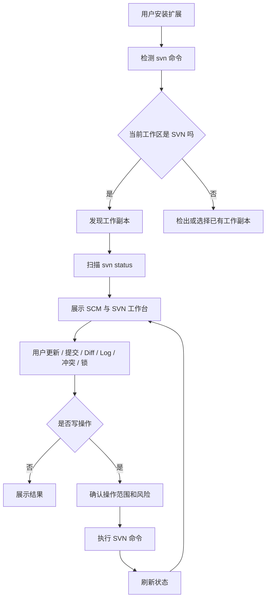

## 7. 从 0 到 1 阶段总览

| 阶段 | 名称 | 目标 | 主要产物 |
| --- | --- | --- | --- |
| P0 | 产品定义 | 明确做什么、不做什么 | PRD、流程文档、MVP 边界 |
| P1 | 技术验证 | 证明 SVN + VS Code API 可跑通 | 扩展骨架、命令服务、status 解析 |
| P2 | MVP 提交闭环 | 完成日常提交流程 | SCM、提交页、筛选、commit |
| P3 | 日常管理闭环 | 覆盖 update/diff/log/revert/ignore/lock | SVN 工作台、日志、锁、忽略 |
| P4 | 智能与冲突 | 加入 AI 和冲突中心 | AI 推荐、冲突面板、TortoiseMerge 联动 |
| P5 | 发布与迭代 | 打包发布并收集反馈 | VSIX、README、测试报告、发布清单 |

## 8. 产品信息架构

```text
SVN 工作台
  工作台总览
  变更
  提交
  更新
  差异
  历史
  冲突中心
  锁管理
  认证管理
  忽略规则
  设置
  输出诊断
```

VS Code 入口：

- Activity Bar：SVN 工作台。
- Source Control：SVN 状态与提交入口。
- Explorer 右键：文件/文件夹上下文操作。
- Editor 右键：当前文件操作。
- 状态栏：当前修订、改动、远端、冲突。
- 命令面板：全量命令入口。

## 9. 核心设计原则

### 9.1 范围优先

任何操作先确定范围。

示例：

- 右键文件：范围就是这个文件。
- 右键文件夹：范围就是这个文件夹及子目录。
- SCM 全局提交：范围才是整个工作副本。

所有筛选、模板、AI 推荐、全选都不能突破范围。

### 9.2 用户确认优先

危险操作必须确认：

- 提交。
- 删除。
- 还原。
- 强制解锁。
- 解决冲突。
- 修改忽略规则。
- 从版本库移除生成物。

### 9.3 规则优先，AI 辅助

生成物排除、敏感文件识别、冲突阻止等先用确定性规则完成。

AI 做：

- 推荐。
- 解释。
- 生成提交说明。
- 生成忽略规则草案。
- 分析冲突。

AI 不做：

- 自动提交。
- 自动更新。
- 自动删除。
- 自动 resolved。

### 9.4 中文友好

命令文案使用中文 + 标准 SVN 英文：

- 提交 Commit。
- 更新 Update。
- 还原 Revert。
- 检出 Checkout。
- 差异 Diff。
- 日志 Log。
- 锁定 Lock。

## 10. 用户流程一：安装与环境检测

### 10.1 触发

用户安装扩展并打开 VS Code。

### 10.2 流程

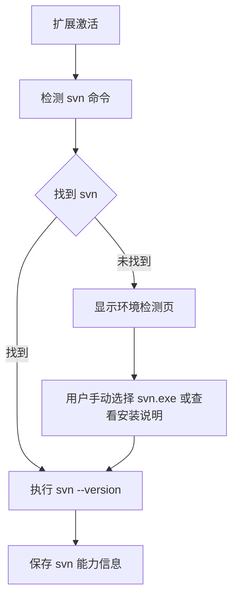

### 10.3 页面内容

环境检测页显示：

- SVN 是否可用。
- SVN 版本。
- 当前配置路径。
- 常见安装位置检测结果。
- 手动选择按钮。
- 重新检测按钮。
- 打开安装说明按钮。

### 10.4 完成标准

- 能识别 PATH 中的 `svn`。
- 能识别用户手动选择的 `svn.exe`。
- 找不到 SVN 时不报错崩溃，而是进入引导页。

## 11. 用户流程二：打开工作副本

### 11.1 触发

用户打开一个文件夹。

### 11.2 流程

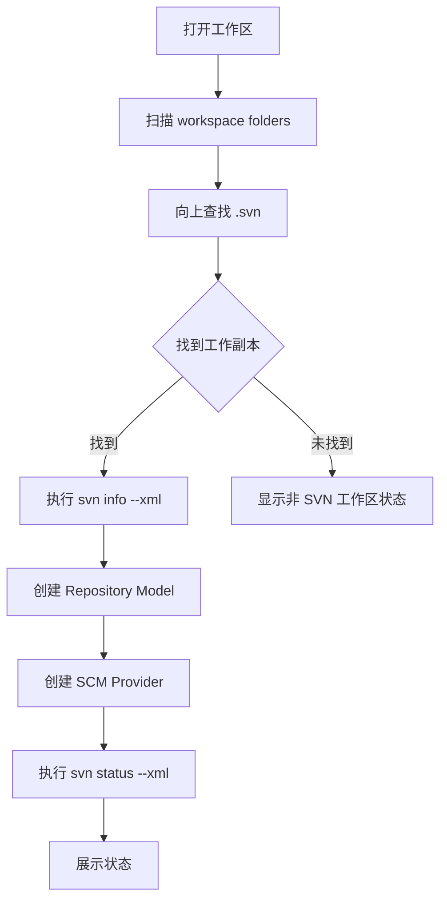

### 11.3 非 SVN 工作区

显示：

- `当前文件夹不是 SVN 工作副本`。
- `检出项目`。
- `选择已有 SVN 根目录`。
- `忽略此工作区`。

### 11.4 完成标准

- 支持单工作区。
- 支持多根工作区。
- 支持中文路径。
- 支持嵌套工作副本识别并提示。

## 12. 用户流程三：检出 Checkout

### 12.1 入口

- 欢迎页。
- 命令面板。
- 资源管理器右键目标目录。

### 12.2 流程

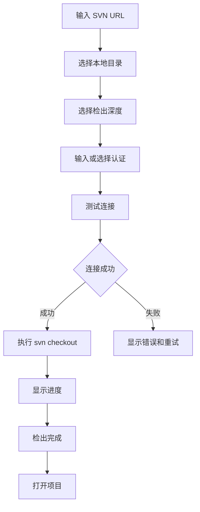

### 12.3 关键细节

- 支持从剪贴板识别 SVN URL。
- 支持最近 URL。
- 支持最近目录。
- 目录非空时确认。
- 认证失败时进入认证管理。

## 13. 用户流程四：日常更新

### 13.1 场景

用户上班后想同步远端。

### 13.2 入口

- 状态栏 `远端 +N`。
- 工作台 `更新工作区`。
- 右键文件夹 `更新此文件夹`。
- 提交页 `更新并继续`。

### 13.3 流程

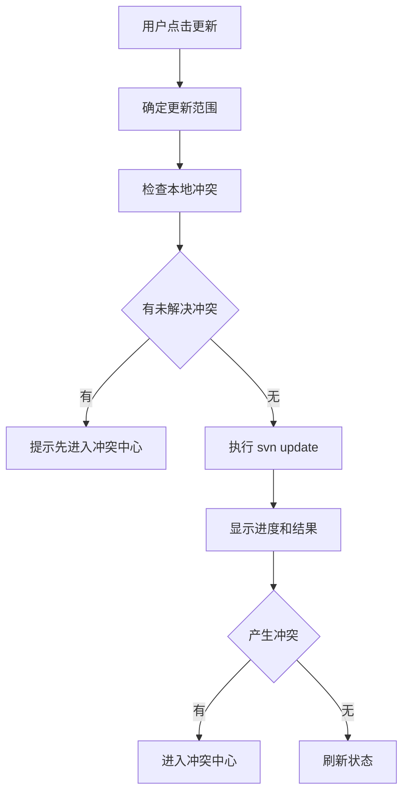

### 13.4 智能更新建议

智能更新只做建议：

- 建议更新。
- 可稍后更新。
- 风险更新。
- 阻止更新。

执行前必须用户确认。

### 13.5 完成标准

- 右键文件夹更新只更新此文件夹。
- 更新过程可取消。
- 更新失败有诊断输出。
- 更新产生冲突后能跳到冲突中心。

## 14. 用户流程五：右键文件夹提交

这是产品最重要的流程之一。

### 14.1 场景

用户只想提交当前模块：

```text
src/pages/order
```

### 14.2 入口

用户在 Explorer 中右键 `src/pages/order`，选择：

```text
SVN -> 提交此文件夹
```

### 14.3 流程

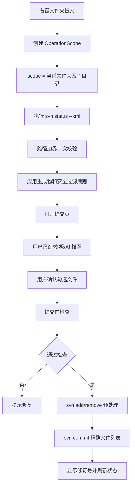

### 14.4 强规则

- 只扫描右键文件夹及其子目录。
- 全选只选当前文件夹范围。
- 文件类型筛选只筛当前文件夹范围。
- 模板筛选只筛当前文件夹范围。
- AI 推荐只推荐当前文件夹范围。
- 搜索清空后仍只显示当前文件夹范围。
- 提交命令使用最终勾选的精确路径列表。

### 14.5 页面顶部必须展示

```text
提交范围：src/pages/order 及其子目录
候选文件：12 个
已勾选：8 个
已排除：4 个
```

### 14.6 完成标准

- 当前文件夹外的文件不会出现在提交候选列表。
- 当前文件夹外的文件不会被 `svn commit` 提交。
- 当前文件夹外有冲突时，只提醒，不阻止当前范围提交。
- 当前范围内有冲突时，阻止提交。

## 15. 用户流程六：提交页筛选与模板

### 15.1 页面结构

```text
顶部：范围 / 远端状态 / 模板 / 筛选 / AI 筛选
左侧：文件列表
右侧：差异预览
底部：提交信息 / 工单号 / 提交按钮
```

### 15.2 筛选流程

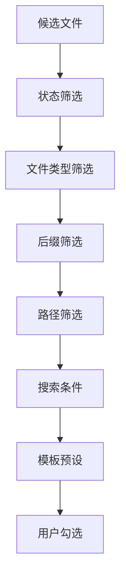

### 15.3 文件类型筛选

默认分类：

- 前端源码。
- 样式。
- 后端源码。
- 配置。
- 文档。
- 图片。
- 数据库。
- 脚本。
- 二进制。
- 其他。

关键规则：

- 点击类型只过滤可见列表。
- 只有点击 `选择当前筛选结果` 才改变勾选。
- 类型数量按当前操作范围计算。

### 15.4 生成物排除

默认建议排除：

- `node_modules/**`
- `dist/**`
- `build/**`
- `.next/**`
- `.nuxt/**`
- `target/**`
- `bin/Debug/**`
- `bin/Release/**`
- `obj/**`
- `__pycache__/**`
- `*.log`
- `*.tmp`

注意：

- 不一刀切排除所有 `bin/**`。
- `bin/deploy.sh`、`bin/tool.ps1` 这类可能是应提交脚本，归类为需要确认。

### 15.5 模板流程

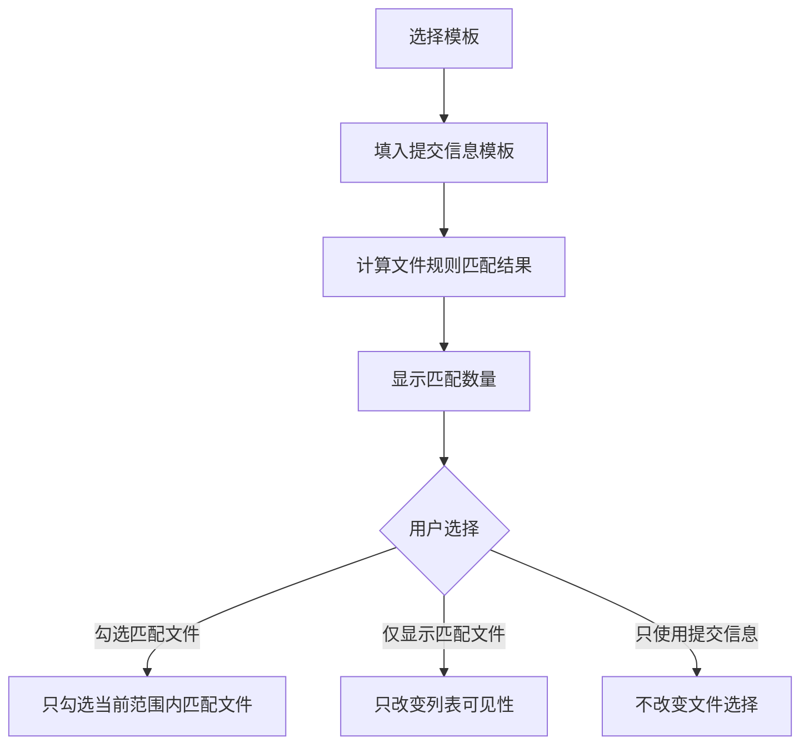

### 15.6 AI 筛选流程

AI 输出：

- 推荐提交。
- 建议排除。
- 需要确认。
- 阻止提交。

用户操作：

- 查看原因。
- 应用推荐。
- 只显示推荐。
- 生成忽略规则草案。

AI 不自动提交，不自动删除，不自动解决冲突。

## 16. 用户流程七：提交执行

### 16.1 提交前检查

点击提交后检查：

1. 是否选择文件。
2. 提交信息是否为空。
3. 当前范围内是否有冲突。
4. 是否有远端更新。
5. 是否有未版本控制文件。
6. 是否有 missing 文件。
7. 是否有敏感文件。
8. 是否有大文件。
9. 是否有他人锁定文件。
10. 是否包含 externals。

### 16.2 预处理

未版本控制文件：

```bash
svn add <path>
```

缺失文件提交删除：

```bash
svn remove <path>
```

提交信息：

```bash
svn commit <selected-files> -F <message-temp-file>
```

### 16.3 提交成功

展示：

```text
提交成功：r12876
已提交 8 个文件
```

按钮：

- 复制提交摘要。
- 查看日志。
- 关闭。

### 16.4 提交失败

展示：

- 中文错误摘要。
- SVN 原始错误。
- 推荐操作。
- 打开输出。
- 复制诊断。

常见失败：

- 认证失败。
- out of date。
- 冲突。
- 他人锁定。
- 路径缺失。

## 17. 用户流程八：差异查看

### 17.1 入口

- 文件行点击。
- 右键文件 `查看差异 Diff`。
- 历史页对比修订。
- 提交页右侧预览。

### 17.2 模式

- Working vs BASE。
- Working vs HEAD。
- Revision A vs Revision B。
- 当前文件 vs 历史版本。

### 17.3 技术流程

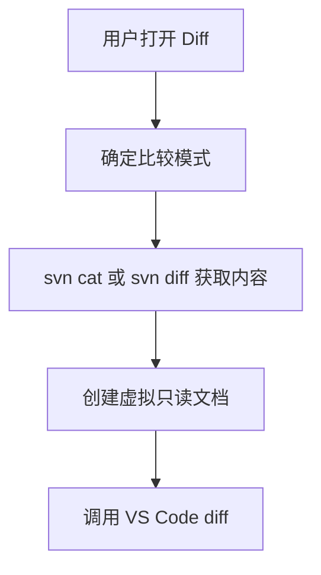

### 17.4 完成标准

- 文本文件能对比。
- 新增文件显示新增内容。
- 删除文件显示历史内容。
- 二进制文件显示文件信息，不做文本 diff。

## 18. 用户流程九：冲突解决

### 18.1 第一阶段方案

MVP 不做完整内置三方合并器。

第一阶段做：

- 冲突列表。
- 打开当前冲突文件。
- 打开 mine/base/theirs 辅助文件。
- 检测冲突标记。
- 调用 TortoiseMerge 外部工具。
- 标记已解决。

### 18.2 后续内置面板

内置冲突面板结构：

```text
Mine / Base / Theirs
Result 可编辑
```

冲突块操作：

- 使用我的。
- 使用远端。
- 两边都保留。
- 手动编辑。
- AI 分析。

### 18.3 解决流程

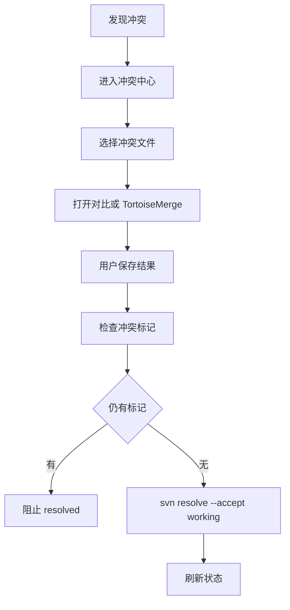

## 19. 用户流程十：日志与历史

### 19.1 入口

- 右键文件。
- 右键文件夹。
- 工作台最近提交。
- 提交成功后。

### 19.2 功能

- 查看仓库日志。
- 查看文件日志。
- 按作者筛选。
- 按日期筛选。
- 按关键字筛选。
- 查看变更文件。
- 对比修订。
- 打开历史版本。

### 19.3 技术命令

```bash
svn log --xml --verbose <path-or-url>
svn cat -r <rev> <path-or-url>
```

## 20. 用户流程十一：锁管理

### 20.1 场景

二进制文件、Office 文件、设计资源需要锁定后编辑。

### 20.2 流程

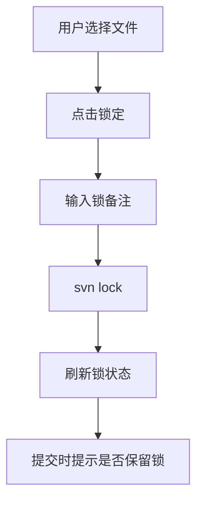

### 20.3 规则

- 他人锁定文件阻止提交。
- 自己锁定文件可提交。
- 提交后默认释放锁。
- 可勾选提交后保留锁。

## 21. 用户流程十二：忽略规则

### 21.1 场景

用户发现大量 `dist`、`obj`、`*.log` 文件不应该提交。

### 21.2 流程

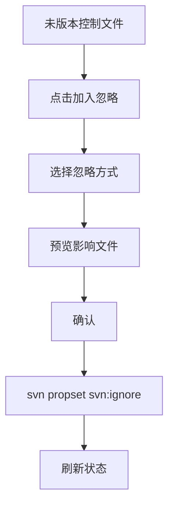

### 21.3 关键提示

- SVN 忽略规则是目录属性，不是 `.gitignore`。
- 已经版本控制的文件不会因为忽略规则自动消失。
- 从版本库移除但保留本地需要单独确认。

## 22. 用户流程十三：认证管理

### 22.1 第一版策略

优先使用 SVN CLI 自己的认证缓存。

扩展侧提供：

- 认证失败提示。
- 清除/切换凭据入口。
- 可选保存账号映射。
- SecretStorage 保存扩展侧 secret。

### 22.2 风险提示

不建议默认把密码放进命令行参数。

如果必须由插件传递凭据：

- 用户主动开启。
- 输出脱敏。
- 文档说明风险。

## 23. 技术架构总流程

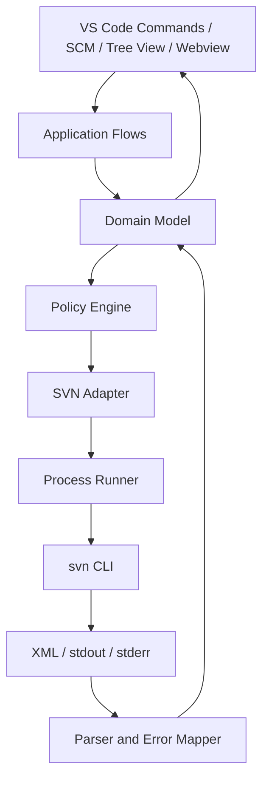

## 24. 模块划分

```text
src/
  extension.ts
  commands/
  repositories/
  svn/
    commandService.ts
    processRunner.ts
    parsers/
    operations/
  scm/
  views/
  webviews/
    commit/
    auth/
    conflicts/
  policies/
    generatedFiles.ts
    sensitiveFiles.ts
    templateRules.ts
  ai/
  integrations/
    tortoiseMerge.ts
  storage/
  diagnostics/
  tests/
```

## 25. 核心领域模型

### 25.1 OperationScope

所有操作必须先创建 OperationScope。

```ts
interface OperationScope {
  repositoryId: string;
  source: 'file' | 'folder' | 'workspace' | 'scmSelection' | 'commitBasket';
  roots: string[];
  allowExpandScope: false;
}
```

规则：

- `allowExpandScope` 第一版固定为 `false`。
- 所有文件必须通过路径边界校验。
- UI 层不能绕过 OperationScope。

### 25.2 WorkingCopyItem

```ts
interface WorkingCopyItem {
  absolutePath: string;
  relativePath: string;
  textStatus: SvnStatus;
  propStatus?: SvnStatus;
  fileType: FileTypeCategory;
  extension: string;
  size?: number;
  isBinary?: boolean;
  isSensitive?: boolean;
  isGenerated?: boolean;
  isExternal?: boolean;
  lock?: SvnLockInfo;
}
```

### 25.3 CommitPlan

```ts
interface CommitPlan {
  scope: OperationScope;
  selectedFiles: WorkingCopyItem[];
  unversionedToAdd: WorkingCopyItem[];
  missingToRemove: WorkingCopyItem[];
  warnings: CommitWarning[];
  blockers: CommitBlocker[];
  message: string;
}
```

## 26. SVN 命令契约

### 26.1 环境

```bash
svn --version --quiet
```

### 26.2 信息

```bash
svn info --xml <path>
```

### 26.3 状态

```bash
svn status --xml <path>
svn status --xml -u <path>
```

### 26.4 提交

```bash
svn add <paths>
svn remove <paths>
svn commit <paths> -F <message-file>
```

### 26.5 更新

```bash
svn update <path>
```

### 26.6 差异和内容

```bash
svn diff <path>
svn cat -r BASE <path>
svn cat -r HEAD <path>
```

### 26.7 日志

```bash
svn log --xml --verbose <path>
```

### 26.8 冲突

```bash
svn resolve --accept working <path>
```

### 26.9 锁

```bash
svn lock <path>
svn unlock <path>
```

### 26.10 忽略

```bash
svn propget svn:ignore <dir>
svn propset svn:ignore <value> <dir>
```

## 27. UI 页面交付顺序

### 27.1 第一批

1. 环境检测页。
2. SCM 状态面板。
3. 提交页。
4. Diff 调用。
5. Output Channel。

### 27.2 第二批

1. SVN 工作台总览。
2. 变更页。
3. 日志页。
4. 忽略规则页。
5. 锁管理页。

### 27.3 第三批

1. 冲突中心。
2. 认证管理页。
3. AI 筛选面板。
4. 智能更新页。
5. TortoiseMerge 设置页。

## 28. MVP 功能清单

### 28.1 必须完成

- 扩展激活。
- SVN 路径检测。
- 工作副本发现。
- `svn status --xml` 解析。
- SCM Provider 展示状态。
- 右键文件提交。
- 右键文件夹提交。
- 提交页基础筛选。
- 生成物默认排除。
- `svn add`、`svn remove`、`svn commit`。
- `svn update`。
- `vscode.diff` 差异。
- `svn log` 基础日志。
- `svn revert`。
- Output Channel。

### 28.2 必须验收

- 中文路径可用。
- 右键文件夹不会提交范围外文件。
- `dist`、`bin/Debug`、`obj` 默认不勾选。
- 冲突阻止提交。
- 提交信息为空阻止提交。
- 提交成功显示修订号。
- 失败能复制诊断。

## 29. 开发任务分解

### 29.1 M0 技术验证

任务：

1. 初始化 VS Code Extension TypeScript 项目。
2. 建立 Output Channel。
3. 实现 SVN executable 检测。
4. 实现 ProcessRunner。
5. 实现 `svn info --xml`。
6. 实现 `svn status --xml`。
7. 写 status parser 单元测试。

退出标准：

- 能在本机 SVN 工作副本输出结构化状态。

### 29.2 M1 SCM 与状态

任务：

1. Repository Discovery。
2. Repository Model。
3. SCM Provider。
4. Resource Groups。
5. Refresh。
6. Explorer 右键命令。

退出标准：

- VS Code Source Control 能看到 SVN 变更。

### 29.3 M2 提交闭环

任务：

1. OperationScope。
2. Commit Webview。
3. 文件状态筛选。
4. 文件类型筛选。
5. 生成物规则。
6. 提交前检查。
7. commit -F。
8. 成功刷新状态。

退出标准：

- 可以右键文件夹只提交该文件夹范围。

### 29.4 M3 日常能力

任务：

1. Update。
2. Diff。
3. Log。
4. Revert。
5. Ignore。
6. Lock。

退出标准：

- 日常 SVN 操作基本不需要离开 VS Code。

### 29.5 M4 智能与冲突

任务：

1. AI Provider 抽象。
2. AI 提交说明。
3. AI 筛选建议。
4. 远端检查。
5. 智能更新建议。
6. 冲突中心。
7. TortoiseMerge 外部调用。

退出标准：

- 用户能通过 AI 减少误提交，冲突能被清楚引导处理。

### 29.6 M5 发布

任务：

1. README。
2. CHANGELOG。
3. VSIX 打包。
4. 示例截图。
5. 安装测试。
6. 发布清单。

退出标准：

- 可交给真实用户试用。

## 30. 测试策略

### 30.1 单元测试

覆盖：

- XML parser。
- 状态映射。
- OperationScope 边界。
- 生成物规则。
- 模板筛选。
- 提交前检查。
- 错误映射。

### 30.2 集成测试

准备本地 SVN 测试仓库。

场景：

- 修改文件。
- 新增文件。
- 删除文件。
- missing 文件。
- 冲突文件。
- 未版本控制文件。
- 中文路径。
- 空格路径。
- externals。

### 30.3 端到端测试

流程：

- 安装扩展。
- 打开 SVN 工作副本。
- 修改文件。
- 右键文件夹提交。
- 筛选文件类型。
- 排除生成物。
- 提交成功。
- 查看日志。

### 30.4 手工验收

重点：

- Windows 中文用户名。
- 内网 SVN。
- 自签证书。
- TortoiseSVN 同机安装。
- 大目录提交。
- 误提交防护。

## 31. 安全与隐私

### 31.1 凭据

- 默认依赖 SVN CLI auth cache。
- 扩展保存凭据必须用户主动开启。
- SecretStorage 保存敏感信息。
- 输出和诊断必须脱敏。

### 31.2 AI

- 默认关闭。
- 用户主动开启。
- 发送前展示文件数量和字符数。
- 默认不发送敏感文件内容。
- 可选择只发送文件名和状态。
- 企业可禁用。

### 31.3 危险操作

必须二次确认：

- 还原。
- 删除。
- 强制解锁。
- 解决冲突。
- 修改忽略规则。
- 从版本库移除文件。

## 32. 性能策略

### 32.1 状态扫描

- debounce。
- 按工作副本串行。
- 右键文件夹只扫描该文件夹。
- 大仓库提示扫描中。

### 32.2 提交页

- 文件列表虚拟滚动。
- diff 懒加载。
- 大文件不自动加载 diff。
- AI 限制最大文件数和 diff 字符数。

### 32.3 远端检查

- 不高频自动执行。
- 用户触发或定时低频执行。
- 超时可取消。

## 33. 发布策略

### 33.1 内测版

版本：

```text
0.1.0
```

范围：

- Windows 本地。
- 基础 SVN。
- 右键文件夹提交。
- 生成物排除。

### 33.2 公测版

版本：

```text
0.5.0
```

范围：

- 工作台。
- 日志。
- 忽略。
- 锁。
- AI 提交说明。
- TortoiseMerge 联动。

### 33.3 正式版

版本：

```text
1.0.0
```

范围：

- 核心稳定。
- 文档完善。
- 测试覆盖。
- 错误诊断完善。
- 真实团队试用反馈处理。

## 34. 风险清单

| 风险 | 等级 | 对策 |
| --- | --- | --- |
| 操作范围错误导致误提交 | P0 | OperationScope + 提交前最终路径确认 |
| SVN XML 解析差异 | P0 | fixture 测试 + 多版本 SVN 测试 |
| 中文路径乱码 | P1 | 编码服务 + Windows 中文路径测试 |
| 凭据泄露 | P1 | 默认 SVN auth cache + 输出脱敏 |
| 大仓库卡顿 | P1 | 范围扫描 + 虚拟列表 + debounce |
| 智能更新误导 | P2 | 文案定位为建议，不承诺精确 |
| 内置合并器周期过长 | P2 | 先外部 TortoiseMerge |
| Remote 支持复杂 | P2 | MVP 本地优先 |

## 35. 决策记录

### 35.1 是否从一开始做完整 Webview 工作台

决策：不做。

理由：

- SCM 和 Tree View 更贴近 VS Code。
- Webview 只用于复杂页面，如提交页、冲突中心、认证管理。

### 35.2 是否从一开始做内置三方合并器

决策：不放 MVP。

理由：

- 成本高。
- TortoiseMerge 可外部兜底。
- MVP 核心价值是提交准确和日常 SVN 流程。

### 35.3 是否允许 AI 自动提交

决策：不允许。

理由：

- 风险太高。
- AI 可推荐，用户必须确认。

### 35.4 是否一刀切排除 bin

决策：不一刀切。

理由：

- `bin/Debug`、`bin/Release` 常是生成物。
- 普通 `bin` 可能包含脚本和工具。

## 36. 后续文档计划

建议继续新增以下文档：

```text
2026-07-04-svn-workbench-commit-page-wireframe.md
2026-07-04-svn-workbench-svn-command-contract.md
2026-07-04-svn-workbench-operation-scope-test-cases.md
2026-07-04-svn-workbench-ui-copy-zh-cn.md
2026-07-04-svn-workbench-release-checklist.md
```

优先级：

1. 提交页线框。
2. SVN 命令契约。
3. OperationScope 测试用例。
4. 中文文案。
5. 发布清单。

## 37. 当前可执行下一步

如果进入开发，下一步不是继续扩功能，而是做技术验证：

1. 初始化 VS Code Extension TypeScript 项目。
2. 实现 `svn --version` 检测。
3. 实现 `svn info --xml`。
4. 实现 `svn status --xml`。
5. 实现 SCM Provider 展示状态。
6. 实现右键文件夹提交的 OperationScope 原型。

这一组完成后，产品从文档进入可运行原型。

## 38. 关联旧文档

旧文档仍保留作为参考：

```text
docs/product-spec.md
docs/page-function-spec-2026-07-04.md
docs/ai-filter-and-merge-panel-spec-2026-07-04.md
docs/technical-feasibility-assessment-2026-07-04.md
```

本文件是总流程，不替代旧文档中的细节；后续开发时以本文件决定顺序，以专项文档补充细节。
