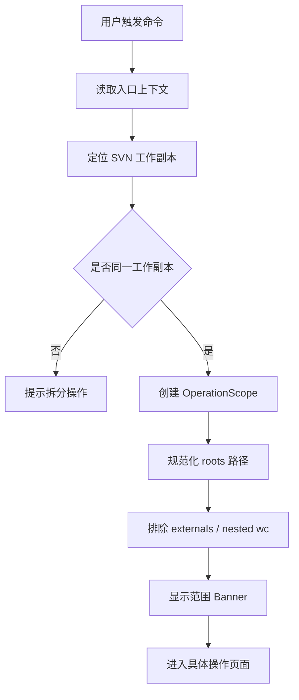
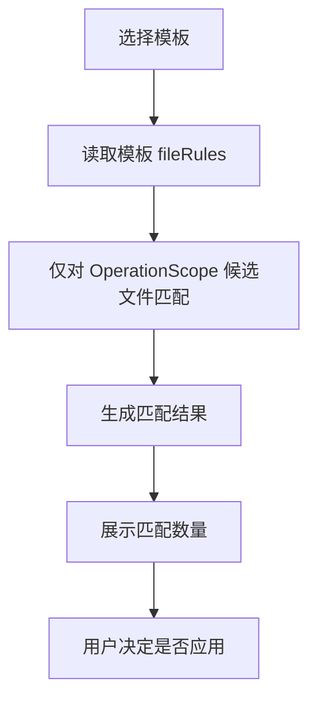

# SVN Workbench OperationScope 交互与范围边界设计

> 产品暂名：SVN Workbench for VS Code / SVN 工作台  
> 文档类型：设计阶段范围交互与安全边界规格  
> 编写日期：2026-07-04  
> 当前阶段：设计阶段  
> 适用平台：Windows / macOS 标准统一  
> 文档策略：新增文件，不覆盖旧文档

## 1. 文档目标

OperationScope 是 SVN Workbench 防误操作的核心模型。

它回答一个问题：

```text
这次操作到底允许影响哪些文件？
```

所有写操作都必须先创建 OperationScope，再执行后续流程。

适用操作：

- 提交 Commit。
- 更新 Update。
- 还原 Revert。
- 删除 Remove。
- 加入版本控制 Add。
- 忽略规则 Ignore。
- 锁定/解锁 Lock/Unlock。
- 冲突标记 Resolve。
- AI 推荐。
- 模板筛选。

## 2. 核心原则

### 2.1 范围先于功能

任何操作流程第一步都必须确定范围。

错误流程：

```text
先扫描整个工作区 -> 再根据入口筛选
```

正确流程：

```text
先确定 OperationScope -> 只扫描 OperationScope -> 再筛选
```

### 2.2 范围不可被隐式扩大

以下行为都不能扩大范围：

- 全选。
- 清空筛选。
- 选择模板。
- AI 推荐。
- 搜索。
- 显示排除文件。
- 显示未版本控制文件。
- 查看远端更新。
- 从 Diff 返回。

### 2.3 用户必须看见范围

所有写操作页面必须展示范围。

示例：

```text
范围：src/pages/order 及其子目录
```

### 2.4 平台标准统一

Windows/macOS 的范围规则完全一致。

平台差异只允许存在于路径适配层：

- Windows 路径分隔符。
- macOS 路径分隔符。
- 大小写敏感性。
- 符号链接和真实路径。

用户看到的规则必须一致。

## 3. OperationScope 定义

### 3.1 数据结构

```ts
interface OperationScope {
  id: string;
  repositoryId: string;
  source: OperationScopeSource;
  roots: OperationScopeRoot[];
  allowExpandScope: false;
  includeExternals: boolean;
  includeNestedWorkingCopies: boolean;
  createdAt: number;
}

type OperationScopeSource =
  | 'explorerFile'
  | 'explorerFolder'
  | 'explorerMultiSelection'
  | 'editorFile'
  | 'scmSelection'
  | 'workspace'
  | 'commitBasket'
  | 'commandPalette';

interface OperationScopeRoot {
  absolutePath: string;
  relativePath: string;
  kind: 'file' | 'folder';
}
```

### 3.2 第一版固定规则

第一版：

```ts
allowExpandScope = false
includeExternals = false
includeNestedWorkingCopies = false
```

理由：

- 降低误提交风险。
- 简化用户心智。
- 让右键文件夹提交语义清晰。

### 3.3 范围来源

| 来源 | source | roots |
| --- | --- | --- |
| Explorer 右键文件 | `explorerFile` | 当前文件 |
| Explorer 右键文件夹 | `explorerFolder` | 当前文件夹 |
| Explorer 多选 | `explorerMultiSelection` | 多个文件/文件夹 |
| 当前编辑器 | `editorFile` | 当前文件 |
| SCM 选中项 | `scmSelection` | SCM 选中文件 |
| 工作区提交 | `workspace` | 工作副本根 |
| 提交篮 | `commitBasket` | 提交篮内文件 |
| 命令面板 | `commandPalette` | 根据命令上下文 |

## 4. 范围创建流程



## 5. 各入口范围规则

### 5.1 右键文件

入口：

```text
Explorer -> SVN -> 提交此文件
```

范围：

```text
仅当前文件
```

页面文案：

```text
提交此文件
范围：src/pages/order/OrderList.vue
```

规则：

- 只展示当前文件。
- 如果当前文件无变更，显示空状态。
- 未版本控制文件可提示 `加入版本控制后提交`。
- 当前文件有冲突则阻止提交。

### 5.2 右键文件夹

入口：

```text
Explorer -> SVN -> 提交此文件夹
```

范围：

```text
当前文件夹及其子目录
```

页面文案：

```text
提交此文件夹
范围：src/pages/order 及其子目录
```

强规则：

- 只执行 `svn status --xml <folder>`。
- 只展示该文件夹内文件。
- 全选只选该文件夹内文件。
- 模板只匹配该文件夹内文件。
- AI 只分析该文件夹内文件。
- 最终 commit 路径必须全部在该文件夹内。

### 5.3 Explorer 多选

入口：

```text
Explorer 多选 -> SVN -> 提交所选范围
```

范围：

```text
多个文件/文件夹范围并集
```

页面文案：

```text
提交所选范围
范围：3 个路径
```

范围详情：

```text
包含：
- src/pages/order/**
- src/common/request.ts
- docs/change-log.md
```

规则：

- 多个根必须属于同一 SVN 工作副本。
- 如果跨工作副本，提示拆分提交。
- 如果包含父子路径，自动合并为父路径。

示例：

```text
src/pages/order
src/pages/order/components/Table.vue
```

合并为：

```text
src/pages/order
```

### 5.4 SCM 选中项

入口：

```text
SCM 面板选中文件 -> 提交选择
```

范围：

```text
SCM 选中的文件集合
```

规则：

- 不包含未选中文件。
- 清空筛选不会显示未选中文件。
- 模板不能引入未选中文件。
- AI 不能推荐未选中文件。

### 5.5 工作区提交

入口：

```text
SCM 顶部提交
命令面板 SVN: 提交工作区
工作台 提交变更
```

范围：

```text
当前工作副本根
```

页面文案：

```text
提交工作区变更
范围：当前 SVN 工作副本
```

这是唯一默认允许覆盖整个工作副本的提交入口。

### 5.6 提交篮

入口：

```text
提交篮 -> 提交
```

范围：

```text
提交篮内文件集合
```

规则：

- 只展示提交篮文件。
- 如果文件状态已变化，刷新并提示。
- 提交篮不能自动吸收范围外新变更。

## 6. 范围展示组件

### 6.1 Scope Banner

所有操作页面顶部显示：

```text
范围：src/pages/order 及其子目录
```

状态图标：

- 文件。
- 文件夹。
- 多选。
- 工作副本。
- 提交篮。

### 6.2 Scope Details

点击范围打开详情：

```text
操作范围详情

来源：Explorer 右键文件夹
工作副本：C:\project
范围：
- src/pages/order/**

已排除：
- svn:externals
- 嵌套 SVN 工作副本

允许扩大范围：否
```

按钮：

- 复制范围。
- 打开所在文件夹。
- 查看工作区其他变更。

注意：

`查看工作区其他变更` 只跳转变更页，不改变当前操作范围。

## 7. 路径边界校验

### 7.1 PathBoundaryGuard

所有文件进入操作计划前必须经过：

```text
PathBoundaryGuard
```

职责：

- 规范化路径。
- 解析相对路径。
- 处理符号链接。
- 判断是否在 scope roots 内。
- 处理 Windows/macOS 大小写差异。
- 阻止 `../` 越界。

### 7.2 校验点

必须校验：

- SVN status 结果。
- 文件列表渲染前。
- 模板匹配结果。
- AI 推荐结果。
- 全选结果。
- 提交前最终路径。
- 更新前最终路径。
- 忽略规则影响文件。
- 冲突 resolve 路径。

### 7.3 越界处理

如果发现越界文件：

```text
已忽略范围外文件：src/pages/user/UserList.vue
当前操作范围是 src/pages/order。
```

按钮：

- 查看被忽略文件。
- 打开变更页。
- 关闭。

不提供：

```text
加入当前提交
```

第一版不允许从当前页面扩大范围。

## 8. 与提交页的关系

### 8.1 文件列表

提交页文件列表只接收 OperationScope 内文件。

```text
OperationScope -> svn status -> boundary guard -> commit page items
```

### 8.2 筛选器

筛选器只在已进入页面的候选文件内工作。

```text
候选文件集合 -> 状态筛选 -> 类型筛选 -> 搜索 -> 可见列表
```

不能：

```text
搜索工作区全局文件
```

### 8.3 全选

`全选可提交` 含义：

```text
全选当前 OperationScope 内可提交文件
```

不是：

```text
全选整个工作区可提交文件
```

## 9. 与模板的关系

模板可以：

- 填写提交信息。
- 推荐文件规则。
- 过滤当前范围内文件。

模板不能：

- 引入范围外文件。
- 扩大 OperationScope。
- 自动提交。

模板匹配流程：



如果模板规则匹配范围外路径：

```text
模板中有 5 个规则匹配到范围外文件，已忽略。
```

## 10. 与 AI 的关系

### 10.1 AI 输入范围

AI 只能拿到 OperationScope 内上下文。

发送前确认展示：

```text
范围：src/pages/order
文件数：12
```

### 10.2 AI 输出校验

AI 输出文件路径必须校验。

如果 AI 返回：

```json
{
  "path": "src/pages/user/UserList.vue",
  "decision": "include"
}
```

而当前范围是：

```text
src/pages/order
```

处理：

```text
忽略该建议，并记录诊断。
```

### 10.3 AI 不改变范围

AI 不能建议：

```text
扩大本次提交范围
```

可以建议：

```text
工作区其他目录可能也有相关变更，请到变更页查看。
```

但不能直接加入当前提交。

## 11. 与更新的关系

更新同样遵守 OperationScope。

### 11.1 右键文件夹更新

入口：

```text
SVN -> 更新此文件夹
```

范围：

```text
该文件夹及子目录
```

命令：

```text
svn update <folder>
```

### 11.2 智能更新建议

AI 只能分析当前更新范围。

如果是工作区智能更新，范围是工作副本。

如果是文件夹智能更新，范围是该文件夹。

### 11.3 mixed revision 提示

选择性更新时：

```text
选择性更新可能让工作副本进入 mixed revision 状态。
```

提示不改变范围规则。

## 12. 与还原的关系

还原是高风险操作。

规则：

- 右键文件还原只还原该文件。
- 右键文件夹还原只还原该文件夹内变更。
- SCM 选择还原只还原选中项。
- 工作区还原必须明确显示整个工作副本范围。

确认弹窗：

```text
确认还原当前范围内 5 个文件？
这些本地修改将丢失。
```

## 13. 与忽略规则的关系

忽略规则有目录属性特性，所以要特别小心。

### 13.1 从文件加入忽略

范围：

```text
当前文件所在目录
```

显示：

```text
将修改目录 src/pages/order 的 svn:ignore 属性。
```

### 13.2 从文件夹批量忽略

范围：

```text
当前文件夹
```

必须展示影响：

```text
将影响当前目录下 12 个未版本控制文件。
```

### 13.3 不允许隐式跨目录写 ignore

如果 AI 生成多个目录的 ignore 草案：

- 按目录分组展示。
- 用户逐组确认。

## 14. 与冲突 resolve 的关系

冲突 resolve 只能作用于当前冲突文件。

规则：

- 冲突中心选择文件后，scope 为该文件。
- 批量标记已解决时，scope 为选中的冲突文件集合。
- AI 冲突建议不能 resolve 范围外文件。

标记已解决前：

- 检查冲突标记。
- 检查文件仍在 scope 内。
- 显示将 resolve 的文件列表。

## 15. 多工作副本规则

### 15.1 跨工作副本选择

如果用户多选文件来自不同工作副本：

```text
所选文件属于多个 SVN 工作副本，不能在一次操作中提交。
```

按钮：

- 按工作副本拆分。
- 取消。

### 15.2 拆分操作

拆分后：

```text
将创建 2 个提交范围：
- project-a: 3 个文件
- project-b: 2 个文件
```

第一版可以只提示用户分别提交，不自动开多个提交页。

## 16. externals 与嵌套工作副本

默认：

```text
exclude externals
exclude nested working copies
```

页面提示：

```text
已排除 1 个 svn:externals 目录和 1 个嵌套工作副本。
```

用户可查看详情，但第一版不默认加入。

如果后续允许包含：

- 必须显式开关。
- 必须二次确认。
- 必须在提交页顶部展示。

## 17. 符号链接与真实路径

Windows/macOS 都可能存在符号链接或 junction。

规则：

- 显示使用用户选择路径。
- 安全判断使用真实路径。
- 如果真实路径越界，阻止操作。

提示：

```text
该路径通过符号链接指向当前范围外，已阻止。
```

## 18. UI 文案

### 18.1 范围 Banner

```text
范围：src/pages/order 及其子目录
```

### 18.2 多选范围

```text
范围：3 个选中路径
```

### 18.3 工作区范围

```text
范围：当前 SVN 工作副本
```

### 18.4 越界提示

```text
已忽略范围外文件。当前操作不能包含这些文件。
```

### 18.5 跨工作副本提示

```text
所选路径属于多个 SVN 工作副本，请分别操作。
```

### 18.6 externals 提示

```text
svn:externals 默认不包含在本次操作中。
```

## 19. 错误状态

### 19.1 找不到工作副本

```text
当前路径不属于 SVN 工作副本。
```

按钮：

- 选择 SVN 根目录。
- 检出项目。

### 19.2 范围为空

```text
当前范围没有可操作文件。
```

按钮：

- 刷新。
- 查看工作区其他变更。

### 19.3 范围失效

例如文件夹被删除。

```text
操作范围已失效，请刷新后重试。
```

### 19.4 路径越界

```text
检测到范围外路径，已阻止操作。
```

按钮：

- 查看详情。
- 复制诊断。

## 20. 数据结构补充

### 20.1 ScopeValidationResult

```ts
interface ScopeValidationResult {
  validItems: string[];
  outOfScopeItems: OutOfScopeItem[];
  excludedExternals: string[];
  excludedNestedWorkingCopies: string[];
  warnings: ScopeWarning[];
}
```

### 20.2 OutOfScopeItem

```ts
interface OutOfScopeItem {
  path: string;
  reason:
    | 'outsideScopeRoot'
    | 'differentRepository'
    | 'external'
    | 'nestedWorkingCopy'
    | 'symlinkOutside'
    | 'invalidPath';
}
```

### 20.3 ScopeDisplayModel

```ts
interface ScopeDisplayModel {
  title: string;
  subtitle: string;
  details: string[];
  excludedSummary?: string;
}
```

## 21. 技术验证关联

技术验证阶段必须优先验证：

1. Windows 路径规范化。
2. macOS 路径规范化。
3. 右键文件创建 scope。
4. 右键文件夹创建 scope。
5. 多选文件/文件夹创建 scope。
6. 父子路径合并。
7. 跨工作副本检测。
8. externals 排除。
9. 嵌套工作副本排除。
10. AI 输出越界拦截。
11. 模板匹配越界拦截。
12. 最终提交路径越界拦截。

## 22. 验收用例

### 22.1 右键文件

| 用例 | 预期 |
| --- | --- |
| 右键单文件提交 | 只展示该文件 |
| 该文件无变更 | 显示空状态 |
| 该文件冲突 | 阻止提交 |
| AI 推荐其他文件 | 忽略 |

### 22.2 右键文件夹

| 用例 | 预期 |
| --- | --- |
| 右键 `src/a` | 只展示 `src/a` 内文件 |
| 清空筛选 | 仍只展示 `src/a` |
| 全选 | 只选 `src/a` |
| 模板匹配 `src/b` | 忽略 `src/b` |
| AI 推荐 `src/b` | 忽略并提示 |
| 最终 commit | 路径全在 `src/a` |

### 22.3 多选

| 用例 | 预期 |
| --- | --- |
| 多选同仓库文件 | 创建并集 scope |
| 多选父子路径 | 合并为父路径 |
| 多选跨仓库 | 阻止并提示拆分 |
| 多选文件夹和文件 | 按并集展示 |

### 22.4 SCM 选择

| 用例 | 预期 |
| --- | --- |
| SCM 选 3 个文件提交 | 只展示这 3 个 |
| 模板匹配其他文件 | 不加入 |
| AI 推荐其他文件 | 不加入 |

### 22.5 跨平台

| 用例 | Windows | macOS |
| --- | --- | --- |
| 空格路径 | 通过 | 通过 |
| 中文路径 | 通过 | 通过 |
| 路径大小写差异 | 安全 | 安全 |
| 符号链接越界 | 阻止 | 阻止 |
| 右键文件夹范围 | 通过 | 通过 |

## 23. 当前设计决策

1. 所有写操作必须先创建 OperationScope。
2. 第一版 OperationScope 不允许隐式扩大。
3. 右键文件夹提交只影响当前文件夹及子目录。
4. SCM 选择提交只影响选中文件。
5. 模板和 AI 不能扩大范围。
6. 外部查看全局变更不改变当前操作范围。
7. 跨工作副本不允许一次提交。
8. externals 和嵌套工作副本默认排除。
9. Windows/macOS 范围规则完全统一。

## 24. 下一步

OperationScope 交互设计完成后，设计阶段下一份文档建议写：

```text
2026-07-04-svn-workbench-ui-copy-zh-cn.md
```

重点细化：

- 全部中文按钮文案。
- 空状态文案。
- 错误提示文案。
- 风险确认文案。
- AI 提示文案。
- Windows/macOS 统一措辞。
