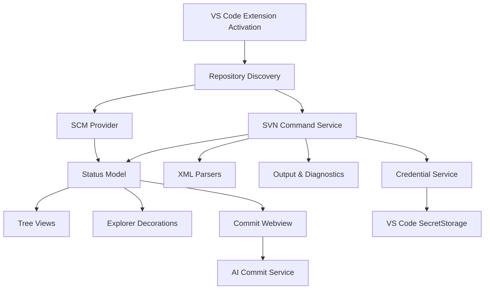

> **归档声明（2026-07-30）**：本文仅用于追溯早期产品论证。原权威声明已失效；当前规则以 [`current`](../../current/) 为准。
> **本文在 v1 不落地的章节（已归后期）**：§5.1 Activity Bar SVN 工作台（5 视图）、§5.2 Source Control / SCM Provider 深度接入、§6.2/§6.3 第一/二阶段增强、§8 SCM Provider 接入、里程碑 M2/M3/M4。v1 仅做 Explorer 右键命令 + webview，UI 栈定为 Svelte。

# VSCode SVN 管理器产品与技术方案

> 当前阶段：产品设计文档初稿  
> 编写日期：2026-07-04  
> 目标：面向中国团队日常开发的现代化 VS Code SVN 管理器

## 1. 产品定位

做一款“打开 VS Code 就能顺手完成 SVN 日常工作”的扩展。它不是简单包装命令行，也不是把 TortoiseSVN 菜单搬进 VS Code，而是围绕国内团队常见流程做一层更清晰、更安全、更省操作的 SVN 工作台。

核心价值：

- 日常高频操作少点几次：更新、提交、查看差异、解决冲突、锁定文件、查看日志都在 VS Code 内完成。
- 先更新再提交、提交前检查、中文提交模板、需求单/缺陷号前缀等流程默认友好。
- 兼容 Windows 办公环境、中文路径、GBK/GB18030 输出、内网 SVN、按目录授权、多账号仓库。
- UI 现代化：状态总览、变更分组、提交篮、冲突中心、历史对比、操作进度都清楚可见。
- 高可靠：SVN 操作放在独立进程，支持取消、超时、输出日志、错误复现信息，不让扩展宿主卡死。

建议产品名暂定为 **SVN Workbench for VS Code**，中文名可叫 **SVN 工作台**。

## 2. 参考对象与可吸收优点

### 2.1 summer198971/vscode-svn

参考仓库：<https://github.com/summer198971/vscode-svn>

值得吸收：

- 中文用户心智明确，命令名直接使用“上传文件、更新目录、管理认证信息”等中文表达。
- 基于原生 SVN 命令行，跨 Windows/macOS/Linux，不强依赖 TortoiseSVN。
- 已覆盖检出、文件/文件夹提交、更新、恢复、日志、认证、锁定/解锁、冲突扫描等高频操作。
- 有 AI 生成提交日志、代码变更分析、本地缓存、多模型配置等方向，适合升级成“提交助手”。
- 对中文编码、过滤规则、missing 文件、svn:externals 等国内项目常见坑有意识。

需要加强：

- 右键菜单型体验适合快速上手，但长期使用需要更强的 SCM 面板和工作台总览。
- “上传”符合部分团队说法，但建议 UI 同时显示标准术语：`提交 Commit`，避免 SVN 新老用户混淆。
- AI 能力需要明确隐私边界，默认只分析用户勾选的 diff，不上传未选文件和密钥。

### 2.2 VisualSVN for Visual Studio

参考页面：<https://www.visualsvn.com/visualsvn/>

值得吸收：

- 实时状态很强：工作副本变化、属性变化、解决方案外文件变化都能即时反馈。
- 交通灯式状态适合普通用户：绿色正常、黄色有变更、红色冲突/错误。
- Quick Diff 直达编辑器，可以查看变更块、在局部范围内导航和回退。
- 文件操作跟踪完善：在 IDE 内新增、删除、重命名、重构后能自动映射到 SVN 操作。
- SVN 操作在外部进程执行，IDE 不容易被 SVN 命令拖死。
- 工具栏提供当前分支/URL 下拉，分支切换很顺手。

需要转化：

- VS Code 没有 Visual Studio 的解决方案模型，应以工作区、多根目录和 `.svn` 工作副本为核心。
- TortoiseSVN 对话框不可作为基础依赖，但可作为可选增强：检测到 TortoiseSVN 时允许“用 Tortoise 打开日志/冲突编辑”。

### 2.3 JohnstonCode/svn-scm

参考仓库：<https://github.com/JohnstonCode/svn-scm>

值得吸收：

- 深度接入 VS Code Source Control API，而不是只做右键命令。
- 功能面完整：Checkout、Source Control View、Quick Diff、状态栏、changelist、add/revert/remove、branch/switch、patch、diff、commit、log。
- 配置项成熟：SVN 路径、编码、externals、多工作副本扫描、删除文件策略、远端变更检查、trunk/branches/tags 正则等。
- 多视图设计可借鉴：仓库日志、文件历史、分支变更。

需要加强：

- 英文和配置项偏工程化，国内团队需要更直接的中文引导、预设模板和低门槛错误修复。
- 需要把“状态/日志/冲突/锁/认证”等分散能力组织成更完整的工作台。

### 2.4 SVN-EXT

参考页面：<https://marketplace.visualstudio.com/items?itemName=spmeesseman.svn-scm-ext>

值得吸收：

- 在资源管理器和编辑器右键菜单加入“查看历史”“与 HEAD 比较”等轻量命令。
- 它证明了很多 SVN 高频动作适合放在文件上下文中，而不是都塞进命令面板。

需要加强：

- 只做扩展菜单不够，需要状态视图、提交面板和冲突流程。

### 2.5 TortoiseSVN

参考文档：<https://tortoisesvn.net/docs/release/TortoiseSVN_en/index.html>

值得吸收：

- Windows 用户习惯非常强：图标覆盖、右键菜单、Commit 对话框、Log、Revision Graph、Repo Browser。
- Commit 对话框的文件勾选、分组、忽略、保留锁、最近提交信息很成熟。
- Project Monitor 能监控远端提交并通知用户。
- Lock/Unlock 对二进制文件和设计资源很重要。

需要转化：

- VS Code 里应提供轻量版本的 Revision Graph 和远端提交提醒，不强求一开始做完整图谱。
- 图标覆盖可转化为 Explorer decorations、SCM resource states 和状态栏提醒。

### 2.6 KDESvn / RabbitVCS

参考页面：

- <https://apps.kde.org/kdesvn/>
- <https://rabbitvcs.org/>

值得吸收：

- 文件管理器式的自然操作：用户在文件树里看到状态，右键就能处理。
- KDESvn 使用 Subversion 原生 API 的思路提醒我们：长期可以探索 WASM/native helper，但 MVP 先用 `svn` CLI 更稳。
- RabbitVCS 的价值是“简单直观地接入用户已有文件管理习惯”。

## 3. 目标用户与使用场景

目标用户：

- 仍在使用 SVN 的传统行业、政企、制造、游戏、外包、内网研发团队。
- 使用 VS Code 写前端、脚本、嵌入式、配置、文档，但公司版本库是 SVN 的开发者。
- 习惯 TortoiseSVN，但想减少 VS Code 和资源管理器之间来回切换的用户。
- 需要处理中文路径、内网账号、按目录授权、二进制锁、多人覆盖冲突的团队。

核心场景：

- 每天上班先更新工作区，查看远端是否有新提交。
- 修改若干文件后查看差异，按需求单分批提交。
- 提交前自动生成中文提交说明，带需求号/缺陷号/模块前缀。
- 发现冲突后进入冲突中心，按文件逐个解决并标记 resolved。
- 设计图、Excel、配置等二进制文件需要先锁定再编辑。
- 多个 SVN 项目使用不同账号，认证失败时快速切换凭据。
- 新同事输入 SVN URL，一步检出并打开项目。

## 4. 设计原则

1. **先看清，再操作**  
   所有危险操作先展示影响范围：提交哪些文件、回退哪些文件、删除哪些未版本控制文件。

2. **更新优先**  
   国内 SVN 团队常见习惯是“先更新再提交”。提交面板默认检查远端变更，提示是否先更新。

3. **中文友好，但保留 SVN 标准术语**  
   菜单建议写成 `提交 Commit`、`更新 Update`、`还原 Revert`、`检出 Checkout`、`锁定 Lock`。

4. **少打扰，可追溯**  
   普通成功用状态栏/通知轻提示，失败进入输出面板，提供复制诊断信息。

5. **默认安全**  
   AI、认证、强制解锁、删除未跟踪文件、清理工作副本等能力都要有明确确认和隐私说明。

6. **不阻塞编辑器**  
   SVN 命令通过独立进程和队列执行，支持取消、超时、并发限制。

## 5. 信息架构与 UI 方案

### 5.1 Activity Bar：SVN 工作台

新增一个 SVN 图标入口，打开后包含 5 个视图。

| 视图 | 目的 | 核心内容 |
| --- | --- | --- |
| 工作台 | 总览当前仓库状态 | 当前 URL、分支/路径、修订号、远端新提交、冲突数、锁定数 |
| 变更 | 替代散乱右键操作 | 已修改、新增、删除、缺失、冲突、未版本控制、externals |
| 提交篮 | 面向一次提交 | 勾选文件、差异预览、提交模板、AI 生成、提交前检查 |
| 历史 | 查日志和对比 | 仓库日志、文件历史、按作者/关键字/修订号搜索 |
| 冲突与锁 | 专项处理 | 冲突列表、resolved 操作、锁信息、强制解锁入口 |

### 5.2 Source Control 集成

必须接入 VS Code SCM Provider：

- 变更文件出现在源代码管理面板中，状态图标与 Git 体验接近。
- SCM 标题区提供：刷新、更新、提交、查看日志、清理、切换分支。
- 资源行内操作：打开差异、加入提交篮、还原、加入忽略、标记解决。
- 支持多工作副本，每个 provider 显示仓库名和当前 URL 简称。

### 5.3 Explorer 与 Editor 右键菜单

右键菜单保持克制，统一收纳到 `SVN` 子菜单。

文件菜单：

- `提交 Commit`
- `查看差异 Diff with BASE/HEAD`
- `更新 Update`
- `还原 Revert`
- `查看历史 Log`
- `锁定 / 解锁`
- `查看属性 Properties`

文件夹菜单：

- `提交文件夹`
- `更新文件夹`
- `查看文件夹历史`
- `扫描冲突`
- `清理 Cleanup`
- `设置为 SVN 工作副本根目录`

### 5.4 提交面板

提交面板是产品体验的核心。

布局建议：

- 顶部：仓库、URL、当前修订号、远端状态、是否有冲突。
- 左侧：提交文件列表，按状态/目录/后缀/变更大小分组，可搜索。
- 右侧：差异预览，支持 `BASE`、`HEAD`、上一修订对比。
- 底部：提交信息、常用前缀、需求号/缺陷号、AI 按钮、提交按钮。

中文团队增强：

- 提交模板：
  - `需求: `
  - `缺陷: `
  - `优化: `
  - `重构: `
  - `配置: `
  - `文档: `
- 可配置工单正则：如 `JIRA-\d+`、`BUG\d+`、`#\d+`、禅道 ID。
- 提交前检查：
  - 空提交信息阻止。
  - 有冲突阻止。
  - 有远端更新时提示先更新。
  - 勾选文件中包含 `.env`、证书、压缩包、大文件时二次确认。
  - 新增文件过多时提示检查是否误提交 `dist`、`node_modules`、日志文件。

### 5.5 现代化视觉

遵循 VS Code 原生风格，少做重型装饰。

- 使用 VS Code ThemeColor，自动适配深浅主题。
- 状态色：
  - 正常：绿色
  - 修改：黄色/橙色
  - 新增：蓝色
  - 删除/缺失：红色
  - 冲突：红色高优先级
  - 锁定：紫色或钥匙图标
- 卡片只用于工作台摘要和提交检查结果，不做层层嵌套。
- Webview 只用于复杂面板：提交篮、认证管理、冲突中心、历史图谱。
- 简单操作优先用 QuickPick/InputBox/SCM API，避免过度 Webview 化。

## 6. 功能范围

### 6.1 MVP 必须做

| 模块 | 功能 |
| --- | --- |
| 环境检测 | 自动发现 `svn`，支持手动配置路径，显示版本和能力 |
| 仓库发现 | 识别 `.svn` 工作副本，支持多根工作区，支持手动设置根目录 |
| 状态扫描 | `svn status --xml`，状态分组，Explorer decoration，SCM provider |
| 更新 | 文件、目录、工作区更新，显示进度和更新结果 |
| 提交 | 勾选文件、提交信息、提交前检查、成功后刷新 |
| 差异 | 与 BASE/HEAD 对比，打开远端版本临时文档 |
| 新增/删除/还原 | add、remove、revert，missing 文件识别 |
| 日志 | 仓库日志、文件日志、按修订号打开文件/差异 |
| 认证 | VS Code SecretStorage 保存凭据，按仓库 URL 匹配 |
| 冲突 | 冲突扫描、打开冲突文件、标记 resolved |
| 锁 | lock、unlock、查看锁信息 |
| 输出与诊断 | SVN Output Channel、复制诊断、失败原因中文化 |

### 6.2 第一阶段增强

- AI 生成提交说明，支持本地/企业兼容 OpenAI 接口。
- 常用提交前缀和工单号记忆。
- 远端变更监控和状态栏提醒。
- Changelist 支持：把文件按任务临时分组。
- Patch 创建与应用。
- 忽略规则管理：`svn:ignore` 可视化编辑。
- 分支/标签识别与 Switch。
- Checkout 向导：URL、目录、深度、认证、测试连接、打开项目。

### 6.3 第二阶段高级能力

- Revision Graph 简版：显示 trunk/branches/tags 和复制关系。
- Merge 向导：选择源分支、修订范围、预检、冲突处理。
- Repo Browser：浏览远端目录、查看文件、检出子目录。
- 企业策略：提交信息规则、敏感文件规则、大文件规则、externals 规则。
- 和 TortoiseSVN 可选联动：打开 Tortoise 日志、Repo Browser、Revision Graph。

## 7. 中国团队习惯专项设计

### 7.1 语言与命令命名

菜单名称建议同时兼顾口语和标准术语：

- `提交 Commit`，不单独叫“上传”，但可以在说明里写“上传到 SVN”。
- `更新 Update`，强调从仓库拉取。
- `还原 Revert`，危险操作前提示“会丢弃本地修改”。
- `检出 Checkout`，保留英文方便搜索。
- `解决冲突 Resolve`，明确这不是自动合并。

### 7.2 默认工作流

推荐流程：

1. 打开项目后自动扫描状态。
2. 状态栏显示 `SVN r1234 | 3 改动 | 远端 +2 | 无冲突`。
3. 用户点击提交时，先做远端检查。
4. 若有远端更新，提示 `建议先更新后提交`，提供 `更新并继续`。
5. 更新后若有冲突，自动进入冲突中心。
6. 无冲突后回到提交篮，AI/模板生成提交信息。
7. 提交成功后显示修订号，并可复制提交摘要。

### 7.3 编码与中文路径

必须处理：

- Windows 中文用户名和中文项目路径。
- SVN 命令输出的 GBK、GB18030、UTF-8 自动识别。
- 文件内容 diff 的编码检测。
- 控制台乱码时的诊断提示。

实现建议：

- 优先使用 `--xml` 输出解析状态、日志、信息，减少本地化字符串解析。
- 子进程输出按 buffer 接收，再用编码检测解码。
- 设置项提供 `auto / utf8 / gbk / gb18030 / big5`。
- Diff 内容保留原编码读取，展示时转为 VS Code 文档 UTF-8。

### 7.4 内网与多账号

常见情况：

- 公司 SVN 在内网，证书自签。
- 不同项目/目录权限不同。
- 一个用户有多个账号或临时账号。

设计：

- 认证按 repository root URL 和项目 URL 双层匹配。
- 支持“本次使用”“保存到本机”“忘记该仓库凭据”。
- 认证失败后弹窗给出明确动作：重试、换账号、打开凭据管理。
- 不默认关闭证书校验；如用户选择信任证书，要说明风险并记录到本机 SVN 配置。

### 7.5 提交信息模板

默认模板：

```text
类型: 简要说明

关联: 需求/缺陷/任务编号
影响: 影响范围
说明: 关键修改点
```

轻量模板：

```text
需求: 完成 xxx
```

AI 生成规则：

- 输出中文。
- 第一行不超过 50 个中文字符。
- 自动识别新增、修复、删除、重构、配置变更。
- 不编造需求号。
- 对敏感文件只描述文件类型，不泄露具体内容。

## 8. 技术架构

### 8.1 模块划分



建议目录：

```text
src/
  extension.ts
  svn/
    commandService.ts
    repository.ts
    parsers/
      statusXmlParser.ts
      logXmlParser.ts
      infoXmlParser.ts
    operations/
      update.ts
      commit.ts
      diff.ts
      revert.ts
      lock.ts
      checkout.ts
  scm/
    provider.ts
    resourceState.ts
  views/
    workbenchView.ts
    changesView.ts
    historyView.ts
    conflictsView.ts
  webviews/
    commitPanel/
    authManager/
    conflictCenter/
  services/
    credentialService.ts
    encodingService.ts
    aiCommitService.ts
    diagnosticsService.ts
  config/
    settings.ts
```

### 8.2 SVN 命令策略

优先使用结构化输出：

- `svn status --xml`
- `svn info --xml`
- `svn log --xml --verbose`
- `svn list --xml`

普通操作：

- `svn update`
- `svn commit`
- `svn add`
- `svn remove`
- `svn revert`
- `svn resolve --accept working`
- `svn lock`
- `svn unlock`
- `svn cleanup`

差异：

- 本地与 BASE：`svn diff`
- 本地与 HEAD：必要时先拉取远端文本到临时文档，再 VS Code diff。
- 指定修订：`svn cat -r REV` + VS Code diff。

### 8.3 进程与性能

- 所有 SVN 操作进入命令队列。
- 同一工作副本写操作串行，读操作可有限并发。
- 状态扫描 debounce，文件保存/创建/删除后延迟刷新。
- 大工作副本默认只扫描工作副本根，不递归搜索超过配置深度。
- 命令支持取消：VS Code CancellationToken 触发 kill 子进程。
- 长操作显示 progress notification，并输出实时日志。

### 8.4 解析与状态模型

内部统一状态枚举：

```ts
type SvnStatus =
  | 'normal'
  | 'modified'
  | 'added'
  | 'deleted'
  | 'missing'
  | 'unversioned'
  | 'conflicted'
  | 'ignored'
  | 'external'
  | 'replaced'
  | 'obstructed'
  | 'locked';
```

每个文件记录：

- 绝对路径
- 相对路径
- 工作副本根
- 文本状态
- 属性状态
- 远端状态
- 锁信息
- changelist
- 是否选入提交篮

### 8.5 安全与隐私

- 凭据只放 VS Code SecretStorage，不写入明文配置。
- Output Channel 默认隐藏密码、token、Authorization 头。
- AI 默认关闭，需要用户主动配置。
- AI 只读取用户勾选文件的 diff，并限制最大 token/字符数。
- 提供“本次不发送文件内容，只根据文件名和状态生成”的弱隐私模式。
- 企业可配置禁用 AI。

## 9. 设置项建议

```json
{
  "svnWorkbench.svn.path": null,
  "svnWorkbench.language": "zh-CN",
  "svnWorkbench.status.autoRefresh": true,
  "svnWorkbench.status.refreshDebounceMs": 800,
  "svnWorkbench.remote.checkBeforeCommit": true,
  "svnWorkbench.remote.checkFrequencySeconds": 300,
  "svnWorkbench.commit.requireMessage": true,
  "svnWorkbench.commit.requireUpdateFirst": false,
  "svnWorkbench.commit.defaultSelectAll": true,
  "svnWorkbench.commit.templates": ["需求: ", "缺陷: ", "优化: ", "重构: ", "配置: ", "文档: "],
  "svnWorkbench.commit.ticketPattern": "",
  "svnWorkbench.encoding.default": "auto",
  "svnWorkbench.encoding.fallbacks": ["utf8", "gb18030", "gbk", "big5"],
  "svnWorkbench.ignore.defaultRules": ["node_modules", "dist", "build", "out", "*.log", "*.tmp"],
  "svnWorkbench.externals.ignoreOnCommit": true,
  "svnWorkbench.auth.autoSave": true,
  "svnWorkbench.ai.enabled": false,
  "svnWorkbench.ai.provider": "openai-compatible",
  "svnWorkbench.ai.maxDiffChars": 12000
}
```

## 10. 里程碑

### M0：项目骨架与文档

- 初始化 VS Code Extension TypeScript 项目。
- 建立命令服务、配置服务、输出通道。
- 补充 README、贡献说明、开发调试说明。

### M1：可用 MVP

- 自动发现 SVN 工作副本。
- SCM Provider 展示本地状态。
- 支持更新、提交、差异、还原、新增、删除。
- 支持中文编码配置和 SVN 路径配置。
- 支持基础日志查看。

### M2：现代化工作台

- Activity Bar SVN 工作台。
- 提交篮 Webview。
- 冲突中心。
- 认证管理。
- Explorer decorations。

### M3：团队效率

- 提交模板和工单号规则。
- AI 提交说明。
- 远端变更提醒。
- 锁管理。
- Changelist。

### M4：高级 SVN

- 分支/标签识别与 Switch。
- Merge 向导。
- Repo Browser。
- Revision Graph 简版。
- TortoiseSVN 可选联动。

## 11. 验收标准

MVP 完成时至少满足：

- 在 Windows 中文路径项目中能正确识别 `.svn` 工作副本。
- `svn status --xml` 解析正常，修改、新增、删除、缺失、冲突、未版本控制文件分组正确。
- 用户可以从 SCM 面板完成一次提交，并看到提交后的修订号。
- 提交前有空消息、冲突、远端变化提示。
- 用户可以打开文件与 BASE/HEAD 的差异。
- 认证失败时能换账号重试，凭据不会明文写入配置。
- SVN 命令失败时，Output Channel 有可复制诊断信息。

## 12. 主要风险

| 风险 | 对策 |
| --- | --- |
| 各 SVN 版本输出差异 | 优先 XML 输出，建立 fixtures 测试 |
| Windows 编码复杂 | buffer 解码 + fallback + 用户配置 |
| 大仓库扫描慢 | debounce、深度限制、按需刷新、忽略规则 |
| VS Code Webview 过重 | 复杂流程 Webview，普通命令用原生 UI |
| AI 隐私顾虑 | 默认关闭、明确预览、可禁用、只发选中 diff |
| 多工作副本状态混乱 | 每个工作副本独立 Repository Model 和 SCM Provider |

## 13. 首批开发任务拆分

1. 初始化扩展工程和基础命令：`SVN: Show Output`、`SVN: Refresh`。
2. 实现 SVN 可执行文件检测：PATH、常见安装目录、用户设置。
3. 实现工作副本发现：向上查找 `.svn`，多根工作区扫描。
4. 实现 `svn status --xml` 调用与解析测试。
5. 接入 SCM Provider，展示文件状态和基础 diff。
6. 实现 update、revert、add、remove。
7. 实现 commit 流程：勾选文件、输入消息、提交前检查。
8. 实现 log/info 基础展示。
9. 补中文编码处理和诊断输出。
10. 再做提交篮 Webview 和现代化工作台。

## 14. 参考资料

- summer198971/vscode-svn：<https://github.com/summer198971/vscode-svn>
- VisualSVN for Visual Studio：<https://www.visualsvn.com/visualsvn/>
- VisualSVN Features：<https://www.visualsvn.com/visualsvn/features/>
- JohnstonCode/svn-scm：<https://github.com/JohnstonCode/svn-scm>
- SVN-EXT：<https://marketplace.visualstudio.com/items?itemName=spmeesseman.svn-scm-ext>
- TortoiseSVN 文档：<https://tortoisesvn.net/docs/release/TortoiseSVN_en/index.html>
- KDESvn：<https://apps.kde.org/kdesvn/>
- RabbitVCS：<https://rabbitvcs.org/>
